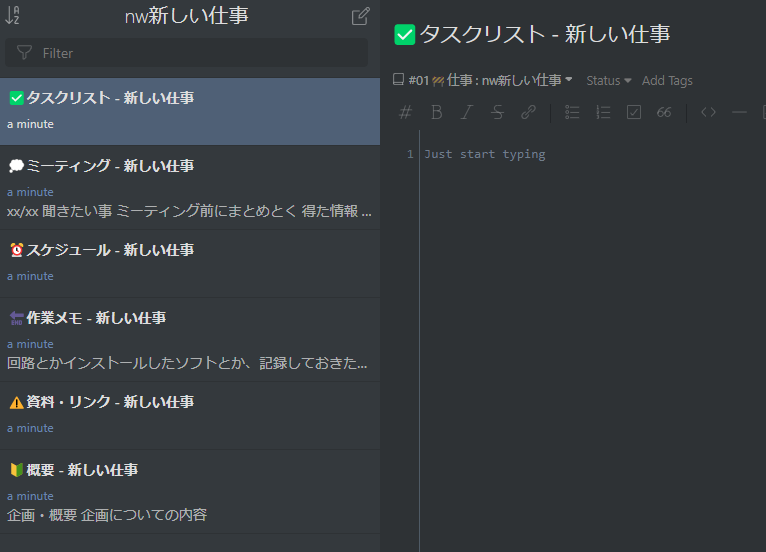

## 仕事用ノートテンプレート
新しい仕事が始まる時、ノートブックを作ってタスク表やミーティングで話したことのメモを書くスペースを作りたかったので、Inkdropのスクリプトを書いてテンプレートを作成するようにした。どこに何を書くべきか決められるので、どこやったけ？とか、覚えておかなきゃいけないことを忘れるみたいな混乱が減った。（無くなったわけではない、減った…）



## スクリプトの書き方
### [Creating a Note Template | Inkdrop Documentation](https://docs.inkdrop.app/manual/creating-a-note-template#add-a-menu-to-invoke-the-command)
ここに書いてあるとおり、WindowsではAppData/Roaming/inkdrop/init.jsにスクリプトを書くことでオリジナルのコマンドを作ったり、メニューに追加することができる。コマンドの追加は`inkdrop.commands.add`, メニューへの追加は`inkdrop.menu.add`で可能。手っ取り早く欲しかったので、

* nwXXXXという名前のノートブックを手動で作る
* nwから始まるノートブックを見つけてそこにじゃんじゃんノートを作っていく

という感じに。インプットダイアログとか使えるのかな…新規にノートを作ってそれを書き換えていく、みたいな書き方をしてるけど、テンプレ用ノートブックを作ってコピーするみたいなやり方にした方が絶対に良いと思う、今度書き直すつもり

```js
const {actions} = require('inkdrop');

inkdrop.commands.add(document.body, 'editor:workingPreset', async () => {
    const {books} = inkdrop.store.getState()

    books.all.forEach(bk => {
        if (bk['name'].substring(0, 2) == "nw") {
            const bookName = bk['name'];
            const workName = bookName.substring(2);

            const notes = [
                {
                    title: '🔰概要 - ' + workName,
                    body: '## 企画・概要\n* 企画についての内容',
                },
                {
                    title: '⚠資料・リンク - ' + workName,
                    body: ''
                },
                {
                    title: '🔄作業メモ - ' + workName,
                    body: '* 回路とかインストールしたソフトとか、記録しておきたい作業工程についてはここ'
                },
                {
                    title: '⏰スケジュール - ' + workName,
                    body: ''
                },
                {
                    title: '💭ミーティング - ' + workName,
                    body: '## xx/xx\n\n### 聞きたい事\n* ミーティング前にまとめとく\n\n### 得た情報\n* とりあえず全部ここに！あとで各箇所に分配する\n\n### 新規タスク\n* これもとりあえず全部ここに'
                },
                {
                    title: '✅タスクリスト - ' + workName,
                    body: ''
                },
                
            ]

            notes.forEach((n, i) => {
                setTimeout(() => {
                    inkdrop.commands.dispatch(document.body, "core:new-note", {});
                }, i * 500);

                setTimeout(() => {
                    inkdrop.store.dispatch(actions.editingNote.update(
                        {
                            title: n.title,
                            body: n.body
                        }
                    ));
                    inkdrop.store.dispatch(actions.editor.change(true));        
                }, i * 500 + 200);
            });
        }
    });
})
  
  inkdrop.menu.add([
    {
      label: 'Edit',
      submenu: [{
        label: 'Working Preset',
        command: 'editor:workingPreset'
      }]
    }
  ])
```