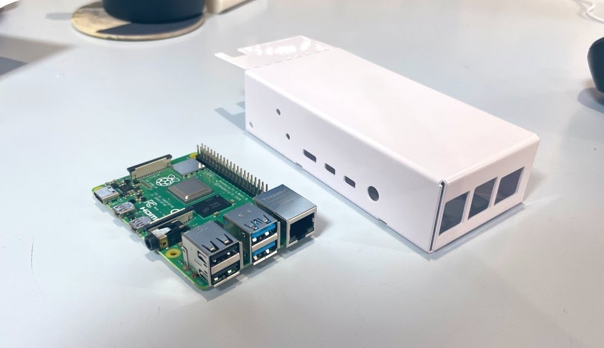
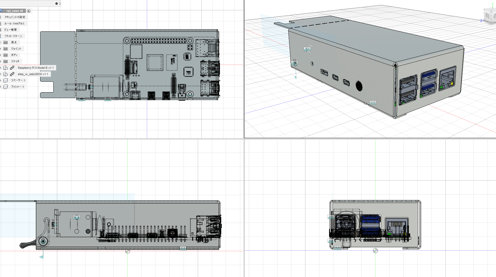
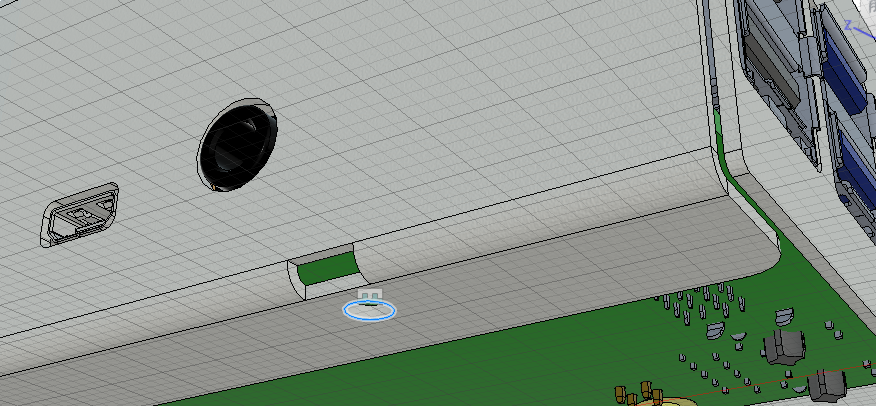
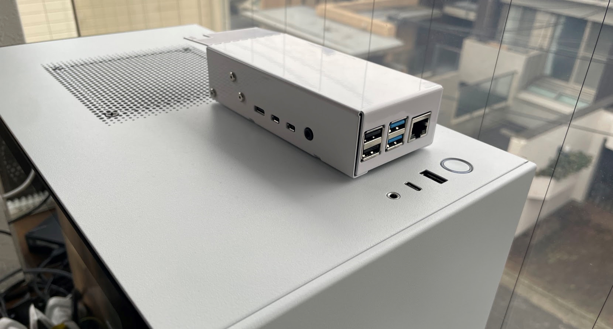
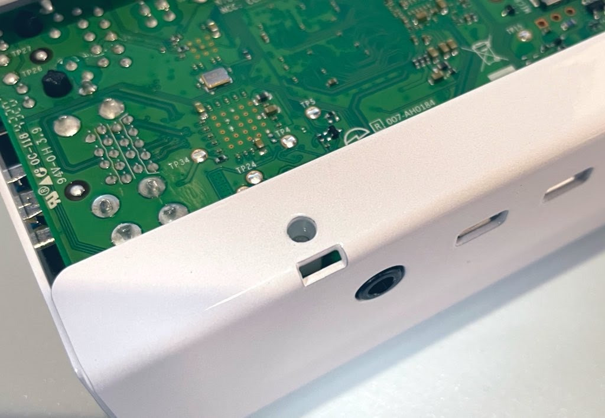
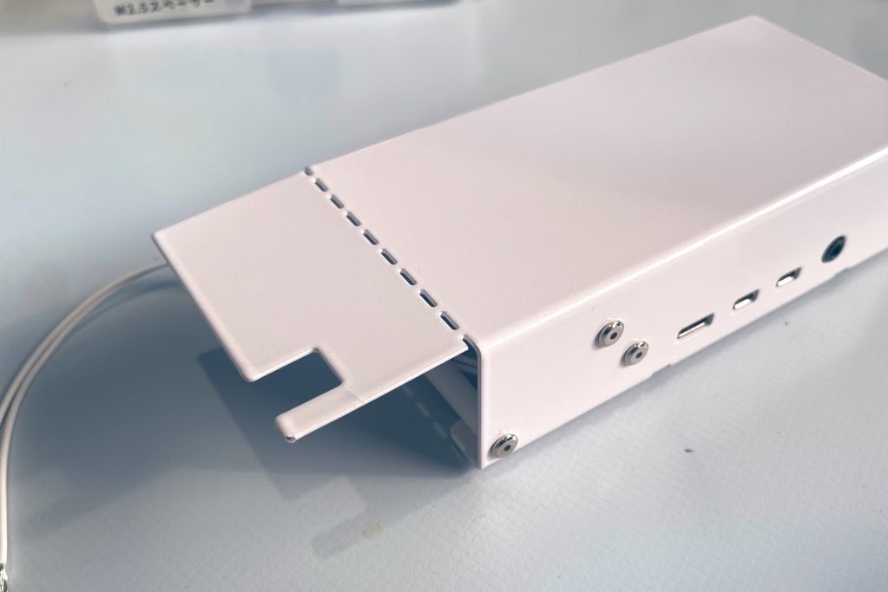

## きっかけ

時々Raspberry piで開発が必要なことがあるので常駐機を用意したかったことと、事務所PCがたまに調子悪くリモートで電源長押しで切ったりしたかったので、その役割もRasPiにやらせようと思いました。

ソレノイドでスイッチを押下させる仕組みにするのでRasPiごと置いておけるような一体型のケース、なおかつNZXTの上に置いていい感じになりそうな白色にしたかったので、[meviyの板金サービス](https://meviy.misumi-ec.com/ja-jp/)でやったことなかった塗装を発注しました。

## Fusion360で設計

設計はFusion360のシートメタル機能を活用しています。曲げRの設定が統一されるのと、箱型にすると逃げの切り欠きを作ってくれるので、大変便利です。Raspberry piの寸法基準となるCADモデルは[Grab CAD](https://grabcad.com/library/raspberry-pi-4-model-b-1)を拝借しました。チップ部品までちゃんと入ってる作り込みなので完全に信頼してビッタシに作りましたが、完璧に合いました。最高。

[Twitterで書いたら大分伸びた](https://twitter.com/loveandsheep145/status/1482688058013421569?s=20)んですが、ラズパイは基板端から固定用の穴までが4ミリもなく、USBポートをケースから見えるようにすると曲げ位置に対して穴が近すぎてしまいます。そういう時は上のように曲げ部分に「逃げ穴」を作ると、穴が曲げに引っ張られて歪むことなくギリギリを攻められるようになるとのこと。小規模小ロットや自分でやったりする時は曲げた後から加工すれば良いって話になるそうですが、量産やmeviyのように統一してレーザーで切り抜いてから曲げる工程だと、こういう処理が効いてくるみたいです。

## 発注＆到着

1/17に発注して、1/22に発送されました。通常3営業日がスタンダードですが、塗装が入ると5営業日になるみたいです。塗装はこれがNZXTに一番近いかなと思って、オフホワイトの半ツヤをチョイスしてみました。半ツヤ、ややマットな感じを想像してたんですが大分ツヤツヤしてる…半っていうより8分ツヤくらいの印象です。でもさすが鉄のケースだけあって、結構しっかり守ってくれてる感があって概ね満足。

逃げ穴もこんな感じで、歪むことなくキレイに穴が開いてます。ボルトもちゃんと入る。

## ”後から曲げ”の実験

更にもう一個実験要素として、手で曲げられるようミシン目？を入れた面を用意しました。もともとここは曲げ装置が入らないので機械では曲げられないのですが、こうすることで一体造形が可能になるので試してみることにしました。[teenage engineering](https://teenage.engineering/products/computer-1)のプロダクトで最近見かけるようになって、かわいいので真似したくなったやつ。ただちょっと寸法を攻めすぎたせいで、これ閉じるとRasPiが出せなくなるっぽいので、中の機構が完成したら閉じる予定です。塗装割れるかなぁ…