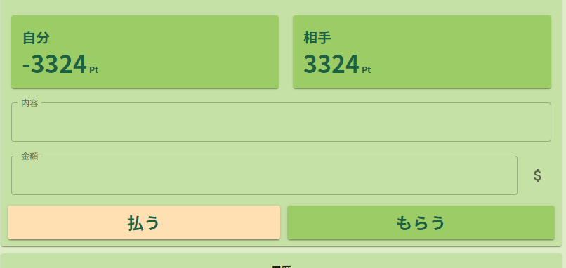
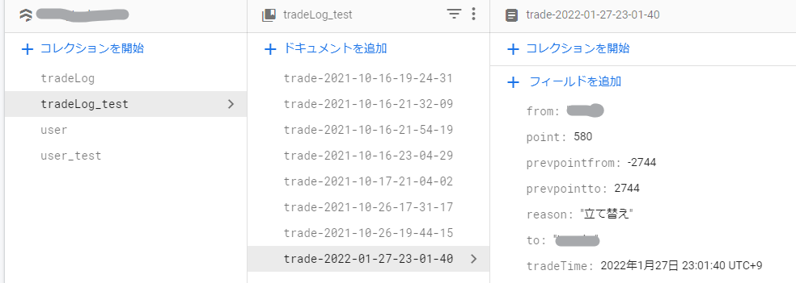
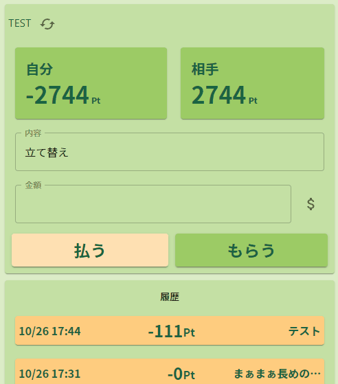

## 超ローカルな立て替えアプリ

Paypayみたいな個人間送金サービスを、自分たちだけが使う用でFirebase上に立て、夫婦間で立て替えの記録をするということをやっています。日本円ではなくポイントという形にして、どちらかに偏ったら清算するというスタイル。

## 日本円じゃない個人間送金がしたい

夫婦間で何か立て替えたり割ったりする時が頻繁にあり、個人間送金アプリとしてKyashを過去に利用していたのですが、銀行口座との連携が取れるようになった2020年9月辺りから現金を一度入れないと送金できなかったりしてう～ん…となっていました。諦めて決済ツールとして長いものに巻かれる形で、Paypayを使ったりpringを検討したりしたんですが、

- チャージ残高が無いと送れない(Kyashだと過去には送金でもVisaからオートチャージできたはず)
- 受け取りも送りっぱなしではなく、相手の **受け取り操作** を必要とする（期限切れになると再送が必要）

などの理由でなんか使いづらい…と。残高が無いと送れないっていうのはまぁ決済サービスなので当然ですが、受け取りにも許可が必要ってのはなんか面倒ですよね…Kyashも現金が絡んだ辺りからそうなったので、法律とかで決まってそうなにおいがします。請求はわかるけど。

とか考えてるうちに **「そもそも日本円をやり取りしなければ良いのでは？」** という結論に至り、こりゃ作った方が早いじゃん！となりました。

## FireStoreデータベース＋FireHostingで簡易サービスを構築

二人が使っているiPhone上で操作したいけど、長い事Macを使っておらずiOSアプリなんもわからんので、前からデータベースだけちょっと触っていた[Firebase](https://firebase.google.com/)を使うことにしました。ホーム画面にブックマークを貼ってればアクセスのしやすさはアプリと変わりませんし、妻にいちいちアプデ作業をしてもらう必要もないので、この規模だと丁度良い感じです。

自分の場合はReactで作って、CLIをインストールできたら`firebase deploy`でサクッとデプロイできるので、ちょこちょこアップデートするのもハードルが低くて良い感じです。データベースのビューアーも見やすい。

今回はユーザーが2人だけなんでURLにそれぞれの名前足してrouterで捌いてますが、[Authenication](https://firebase.google.com/docs/auth?hl=ja)使うとユーザー認証やってくれるらしいんで、別の機会があったら使ってみたい…

## 自分仕様なので基本快適

必要な時に清算すればよいので残高がマイナスでも良いし、受け取る側の許可もいらないので、片方がレジで支払いしてる時にサクッと送金すれば完了してるのはかなりスムーズだなと感じました。もはや請求も大体話してから操作するし、データベース触れば後からいくらでも修正が効くのでここの許可も無しにして「請求」ではなく「もらう」ボタンにしています。

家族カードあるじゃんって話もあるんですけど、ポイント付くつかないとか、自分は事業用カードと生活用カードがあったりとか、そもそも現金しか使えないお店とかがあるのでやっぱあると良いなと思いました。もし将来子どもが生まれたりしたら子供ユーザー作ってキャッシュレス小遣いが出来そう。