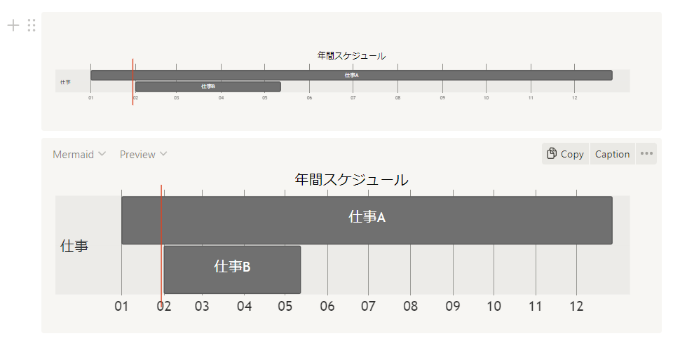
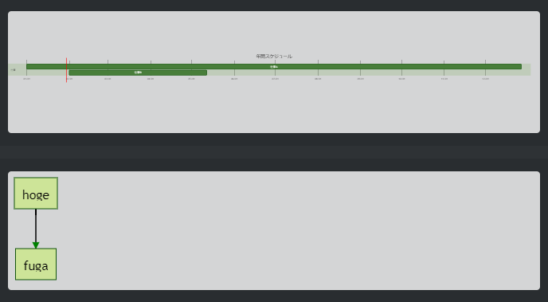
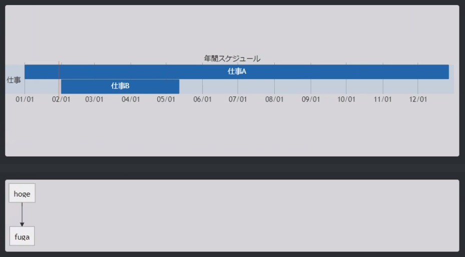
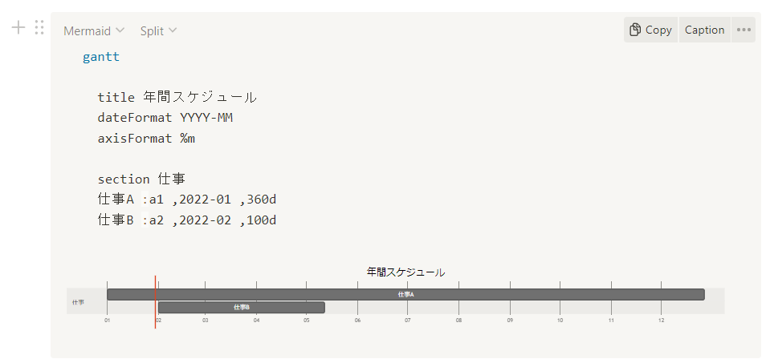
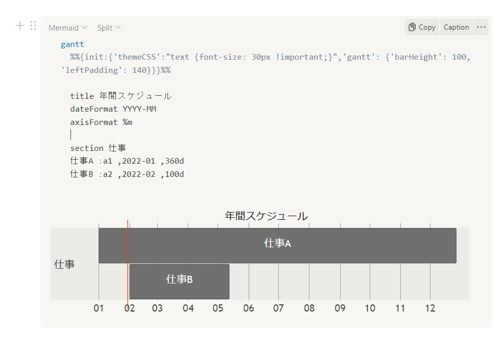
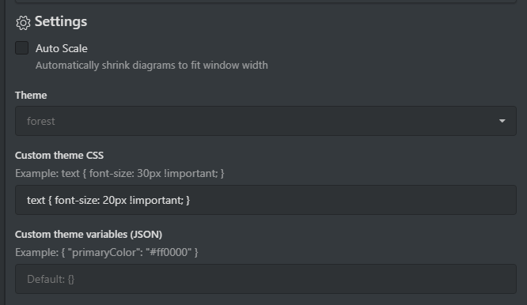
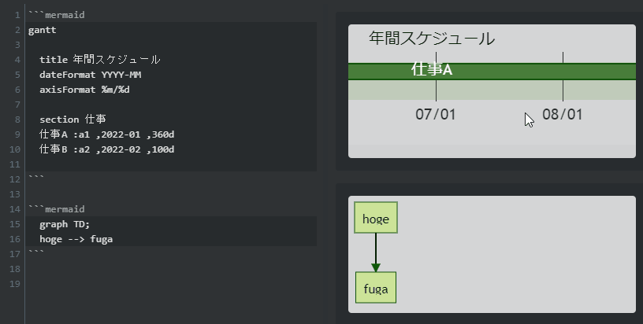

## 横長のGanttがやたらと小さい
InkdropやNotionで図を入れたいときにmermaidプラグインを良く使っているんですが、ガントチャートの表示がやたらと小さかったので、フォントサイズやバーの高さをいじって変更してみました。



## Inkdropのプラグインを書き換える

Inkdropは開発者のTAKUYAさんが[mermaidプラグインを書かれている](https://my.inkdrop.app/plugins/mermaid)ので、それを一部書き換えて自分が見やすいテーマを差し込むことができます。
Windowsの場合プラグインをインストールしたら`AppData/Roaming/inkdrop/packages/mermaid/lib/index.js`に実装ファイルがあるので、以下のようにしてmermaid用のテーマやCSSを追記することができました。

```js
    mermaidAPI.initialize({
      startOnLoad: false,
      theme: inkdrop.config.get('mermaid.theme'),
      themeCSS: 'text {font-size:30px !important;}',
      gantt: {
        barHeight: 40,
        fontSize: 30,
        leftPadding: 120,
      }
    })
```

### Before



### After



下のグラフとフォントのサイズ感が近づいて、読みやすくなりました。

## Notionはインラインでテーマを書き換える

Notionの場合ソースコードをいじったりは難しそうなので、mermaidの中にテーマを記述します。Inkdropでもこの書き方は可能です。

```
gantt
  %%{init:{'themeCSS':"text {font-size: 30px !important;}",'gantt': {'barHeight': 100, 'leftPadding': 140}}}%%

  title 年間スケジュール
  dateFormat YYYY-MM
  axisFormat %m
  
  section 仕事
  仕事A :a1 ,2022-01 ,360d
  仕事B :a2 ,2022-02 ,100d
```

### Before


### After


とりあえずフォントサイズとバーの高さを変更して大分見やすくなりました。

## 参考
- [Mermaid のテーマ・スタイルの変更方法](https://zenn.dev/junkawa/articles/zenn-mermaidjs-theme-config)
- [mermaid/Setup.md at develop · mermaid-js/mermaid](https://github.com/mermaid-js/mermaid/blob/develop/docs/Setup.md)
- [mermaid-gitbook/gantt.md at master · mermaidjs/mermaid-gitbook](https://github.com/mermaidjs/mermaid-gitbook/blob/master/content/gantt.md)

## 追記：Inkdrop Mermaidプラグインがアップデートされました！

<blockquote class="twitter-tweet"><p lang="ja" dir="ltr">Inkdrop Mermaidプラグインv2.4.0リリース！カスタマイズ性を改善しました。 Thanks <a href="https://twitter.com/loveandsheep145?ref_src=twsrc%5Etfw">@loveandsheep145</a> さん<a href="https://t.co/sljYFnU5mv">https://t.co/sljYFnU5mv</a> <a href="https://t.co/wDUQ1zwFoe">pic.twitter.com/wDUQ1zwFoe</a></p>&mdash; TAKUYA🐾個人アプリ作家 (@craftzdog) <a href="https://twitter.com/craftzdog/status/1487629819592404994?ref_src=twsrc%5Etfw">January 30, 2022</a></blockquote> 

TAKUYAさんがこの記事を見て、mermaidのカスタマイズができるようアップデートしてくださいました。ありがとうございます！

プラグインの設定項目に、theme CSSやtheme Variablesを入れられるようになっているのでソースコードをいじらずともカスタマイズが可能になっていました。



Auto Scaleオプションというのも付いたそうで、これをオフにするとリサイズされずにスクロールで見られるようになりました。無理矢理文字サイズ変えるより手軽で良さそうです。



