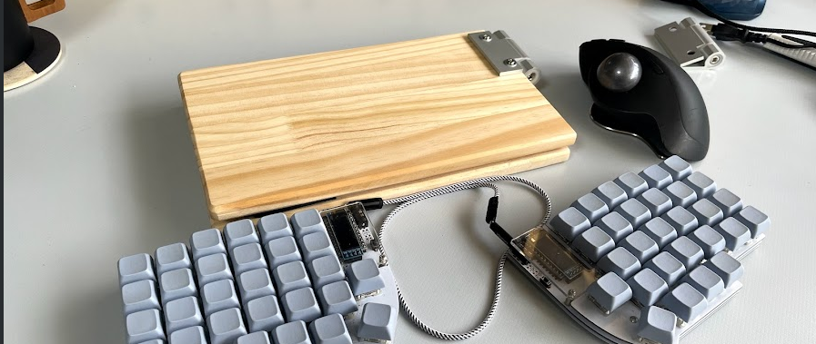
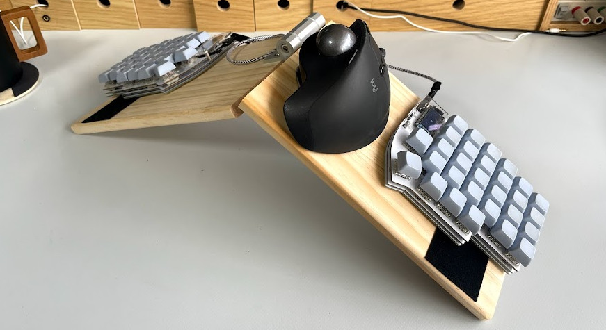
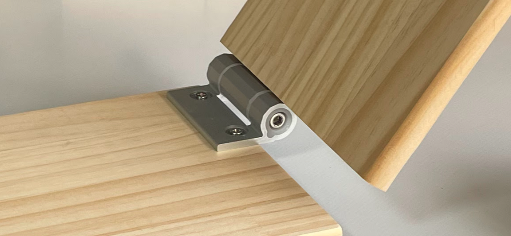
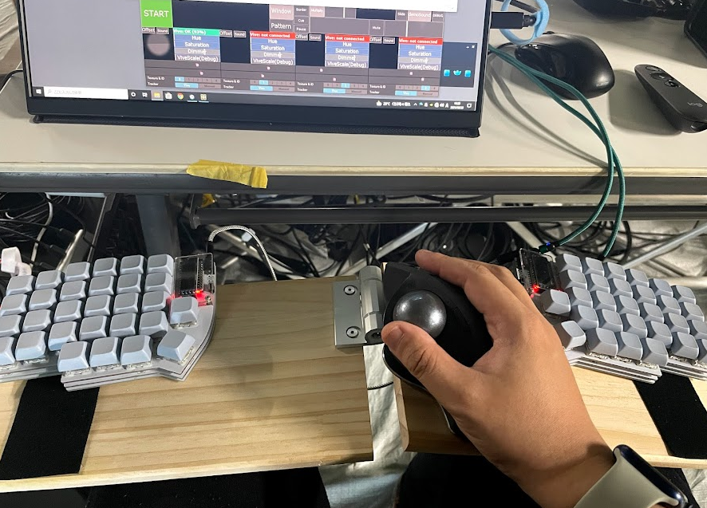
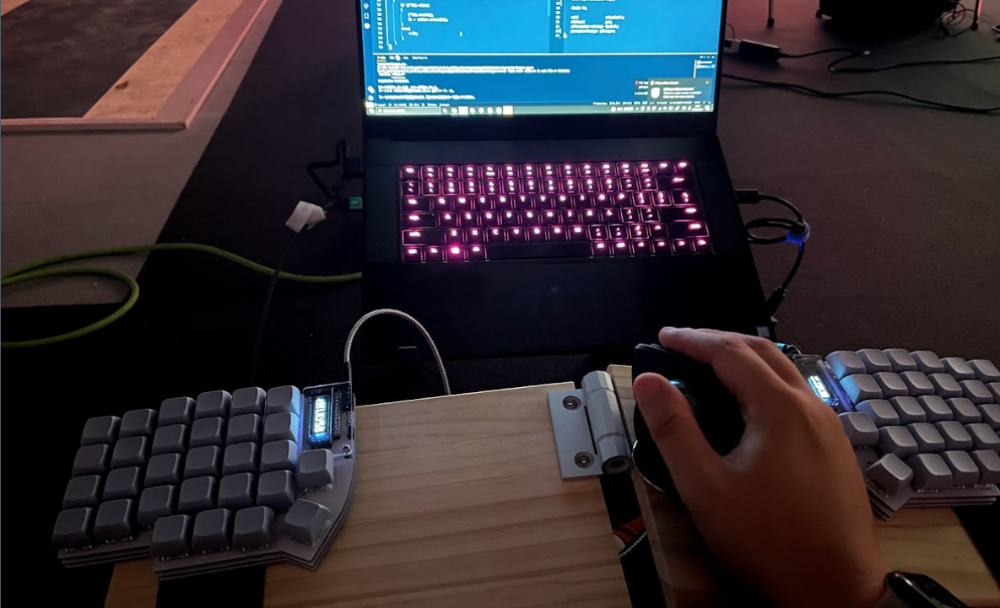
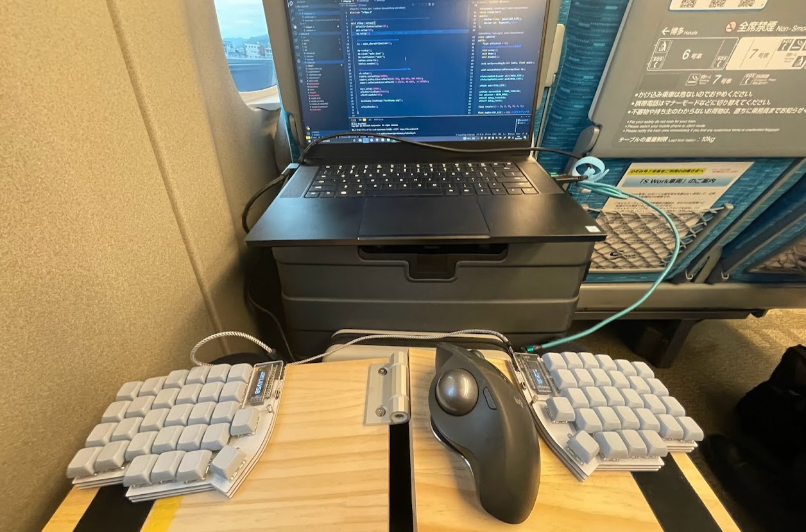

## 現場でも分割キーボードを使いたい
2年ほど前から自分は分割キーボードの[Lily58](https://github.com/kata0510/Lily58)を使っています。壊れるリスクや、レンタルPCなどを使う仕事柄インターフェースは標準が良い、という考えも過去にはあったのですが、Windowsを触る機会が増えてくると、結局メーカーで違ったりして「標準とは…」となりますし、 **自分仕様にキー配列を変えられるメリットがあまりに大きく、** 今では完全に自作派になりました。

しかし展示会場のような場所での仕事では、机が狭かったりキーボード膝置きで作業したかったりするので、分割キーボードはかなり不利なツールになってきます。

## ちっちゃい机を作って膝に置く

コレはなんとかしないといかんとなり、折り畳み式の膝置き用プレートを作りました。半分に切ってもらった板をヒンジで止めているだけのシンプル構造です。ヒンジは「トルクスヒンジ」というタイプで、真ん中のナットを締めると硬さが変わって、自由な角度で固定することができます。

 折り畳みにしたのは持ち歩くためと、**山型に変形**すれば狭い場所でも安定したタイピングができるのではという理由からです。キーボードは滑り落ちないように **マジックテープで固定** してあるのでベスポジを維持できますし、持ったまま移動することも簡単です。普段使いがトラックボールなので、マウスも共存することができます。MX Ergoには角度調整用の磁石がついているので、いずれはコレを利用してくっつくようにしたい。

## 材料

板材は[IPC DIY Lab.](https://diy-lab.jp/)

ヒンジは[ミスミのトルクスヒンジ](https://jp.misumi-ec.com/vona2/detail/110302267670/?KWSearch=%e3%83%88%e3%83%ab%e3%82%af%20%e3%83%92%e3%83%b3%e3%82%b8&searchFlow=results2products&list=PageSearchResult)です。[パソコン音楽クラブのMV撮影](https://newreel.jp/feature/4901)で右左見さんが使ってて「めっちゃ便利っすねこれ！」となっていつか使いたかったやつ。マジックテープはアマゾンで買った普通～のやつです。

## 使用実績

既に実際現場でも何回か使っているんですが、かなり良いです。なんなら普通のキーボードよりも良いかも。モニター置くとキーボード置けない！とか、本番用のデバイス置いとくスペースが必要とかで、キーボードマウスって机必須だけど優先度はかなり低いことが多いと思うんです。

頻繁に動くことになるので、USBケーブルはマグネットで着脱できるタイプにしました。アマゾンに色々な長さのセットのものが売っていて、これを使うと足とか引っかけないし、自分の開発用PCと本番用PCをすぐ行ったり来たりできるというメリットがあります。

床でもまぁまぁ作業できます。（さすがに長くは作業できなかったが、これは単純に床がキツイ）

新幹線では先日 **「テレワーク車両」** とやらに乗って完全テレワーク態勢で京都まで2時間たっぷり作業できました。でも作業できすぎて酔いましたとさ。。

おわり。
