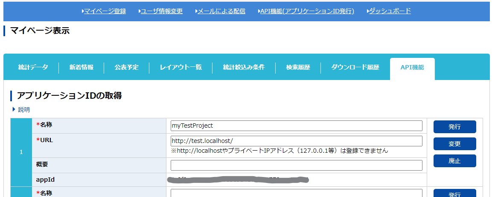
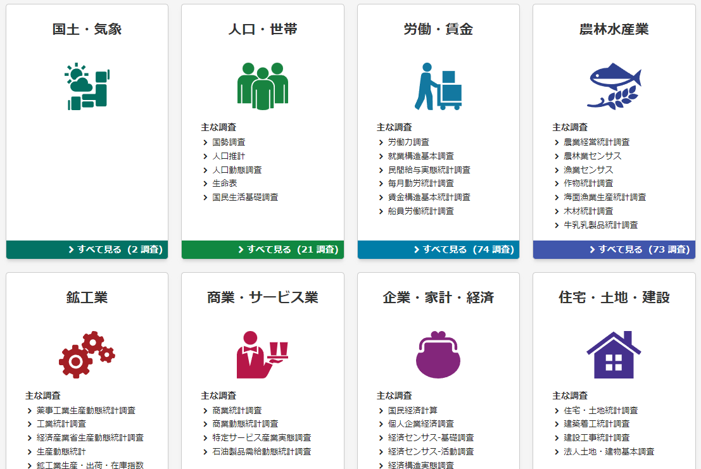

### 政府統計のデータベース「e-Stat」なるものを知る

お仕事で扱うデータの収集について調べていたところ、[政府統計に関するポータルサイト「e-Stat」](https://e-stat.go.jp/)のことを知りました。2008年から本運用を開始したそうで、デジタル庁とか何かと話題だけど、こういう取り組み自体はずっと前から行われてるんですね。

なんか登録とか面倒くさいのかな…と一瞬身構えたのですが、ユーザー登録して、アプリケーションIDを発行すればすぐにデータを取得できる上、[今のところAPIリクエストの使用回数に制限は設けられていない](https://www.e-stat.go.jp/api/api-dev/faq#q_2_3)らしく、[商用利用も可能とかなり自由な規約になっています。](https://www.e-stat.go.jp/terms-of-use)

### さっそく取得してみた



アカウントを登録したら、マイページ＞API機能(アプリケーションID発行)からAppIdを発行します。リクエスト時にこのIDを添えてリクエストするようになっています。

ものすごい色々な統計がデータベース化されてるんで迷ってしまいますが、まずは比較的馴染みのある国勢調査から、 **「年齢（５歳階級），男女，月別人口－総人口（各月１日現在）-令和２年国勢調査基準-」** を取得してみました。タイトルからして国のデータ拾ってるって感じがします。

node.jsでaxiosだけインストールして、以下の要領でGETメソッドを送信するだけです。シンプル。ちなみにデータはXML/JSON/CSVからも選べるそうです。

```js
const axios = require('axios');

const estat_url = 'http://api.e-stat.go.jp/rest/';
const estat_version = '3.0';
const estat_appID = 'YOUR_APP_ID';

const get_kokusei = async() => {
	const ax = axios.create({
		baseURL: estat_url + estat_version + '/app/json'
	})

    //appIDと各データベースの「統計表表示ID」にあたるIDを付加する
	let params = 'appId=' + estat_appID;
	params += '&statsDataId=0003443838';

	try {
		const response = await ax.get('/getStatsData?' + params); //axiosでget
		const statData = response.data.GET_STATS_DATA.STATISTICAL_DATA; //統計データの情報
		const data_inf = statData.DATA_INF;//値を含むテーブル
		const table_inf = statData.TABLE_INF; //指定したデータセットが指し示す統計データの情報
		const title = table_inf.TITLE; //統計表の表題
		const value = data_inf.VALUE; //統計数値の情報
		const class_obj = statData.CLASS_INF.CLASS_OBJ;//メタ情報
		console.log('=== ' + title['$'] + '===');//表題のタイトル
		//メタ情報の一覧を表示
		for (const element of class_obj)
		{
			const childClass = element.CLASS;
			let children = "";
			if (Array.isArray(childClass))
			{
				for (const cc of childClass)
				{
					children += cc['@name'] + '(' + cc['@code'] + ') / ';
				}	
			}
			else
			{
				children += childClass['@name'] + '(' + childClass['@code'] + ')';
			}
			console.log(element['@name'] + '(' + element['@id'] + ')' + ' ::' + children + '\n');
		}

	} catch (error) {
		console.log("Axios response Error");
        console.log(error.response);
	}
}

get_kokusei();
```

上のコードを実行すると以下のような感じでデータのメタ情報一覧がリストアップできます。

```
=== 概算値 年齢（５歳階級），男女，月別人口－総人口（各月１日現在）-令和２年国勢調査基準-===
表章項目(tab) ::人口(001)

人口(cat01) ::総人口(001)

男女別(cat02) ::男女計(000) / 男(001) / 女(002) /

年齢5歳階級(cat03) ::総数(01000) / 0～4歳(01001) / 5～9歳(01002) / 10～14歳(01003) / 15～19歳(01004) / 20～24歳(01005) / 25～29歳(01006) / 30～34歳(01007) / 35～39歳(01008) / 40～44歳(01009) / 45～49歳(01010) / 50～54 歳(01011) / 55～59歳(01012) / 60～64歳(01013) / 65～69歳(01014) / 70～74歳(01015) / 75～79歳(01016) / 80～84歳(01017) / 85～89歳(01018) / 90～94歳(01019) / 95～99歳(01020) / 100歳以上(01021) / （再掲）15歳未満(02000) / （再掲）15～64歳(01023) / （再掲）65歳以上(01024) / （再掲）うち75歳以上(01026) / （再掲）うち85歳以上(01027) /

概算値(cat04) ::概算値(01)

全国(area) ::全国(00000)

時間軸（年月日現在）(time) ::2021年12月(2021001212) / 2022年1月(2022000101) /
```


### 更にデータを絞り込む

この人口統計は男女5歳ごとの大まかな統計なので162件だけですが、10万件を超えるようなデータベースもあります。全部はいらないという時は、これらのメタ情報をもとにデータを絞り込むことができます。たとえば2022年1月期の男女合計を取りたい場合、パラメータを以下の要領で追加します。

```js
	let params = 'appId=' + estat_appID;
	params += '&statsDataId=' + '0003443838';
	params += '&cdCat02=000';//cat02を男女(000)に絞る
	params += '&cdTime=2022000101';//時間軸を2022年1月に絞る
```

値のデータは`STATISTICAL_DATA.DATA_INF.VALUE`に格納されているので、上で定義した変数を`console.log(value)`で見てみると、以下の情報が出力されました。

```js
{
  '@tab': '001',
  '@cat01': '001',
  '@cat02': '000',
  '@cat03': '01000',
  '@cat04': '01',
  '@area': '00000',
  '@time': '2022000101',
  '@unit': '万人',
  '$': '12544'
}
```

これで今年1月現在の日本人口が1億2544万人であることが政府統計から分かりました。着実に減少していますね…データ構造やパラメータによる絞り込みなどのAPI仕様は[ここで見ることができます。](https://www.e-stat.go.jp/api/api-info/api-spec)

### 実益も兼ねて遊べそう



かなり色々な、というか政府による統計は基本的に全て見られるんでしょうか。ものすごい量の統計があって面白いです。データビジュアライズや、APIをさばく練習にもなりそう。

ただAPIから取得できるデータベースは、ファイルとしてアップロードされているものが683なのに対して274と半分以下(2022年2月4日現在)なので、気になる統計を見つけても取得できない可能性もまだありそうです。デジタル庁のテコ入れでこの辺の割合も増えるようになったりするのでしょうか。気になる。