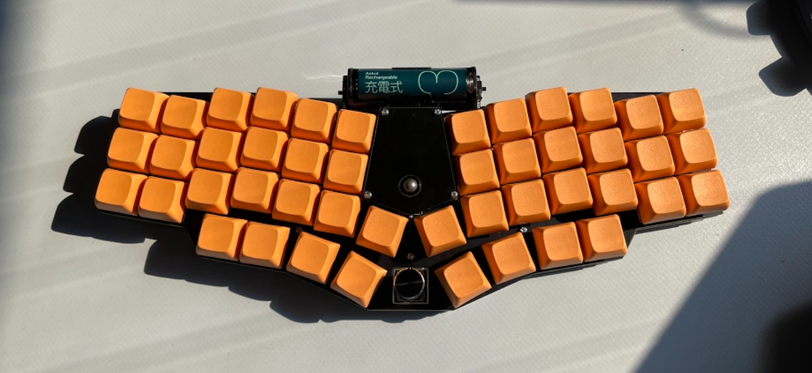
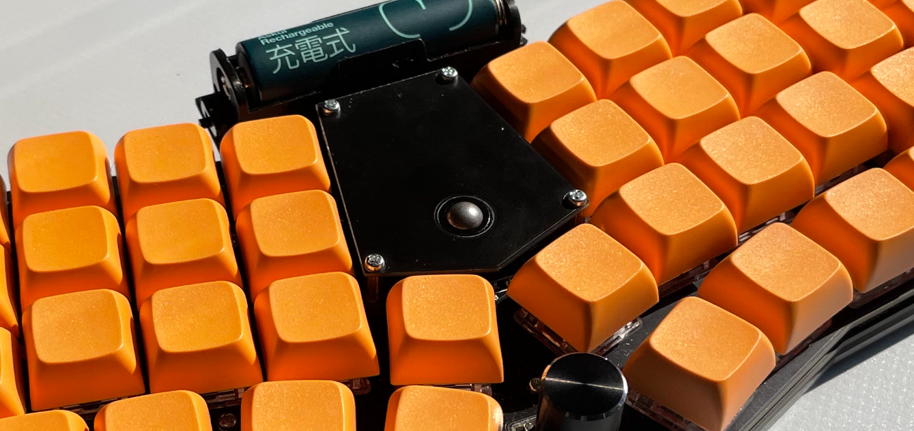
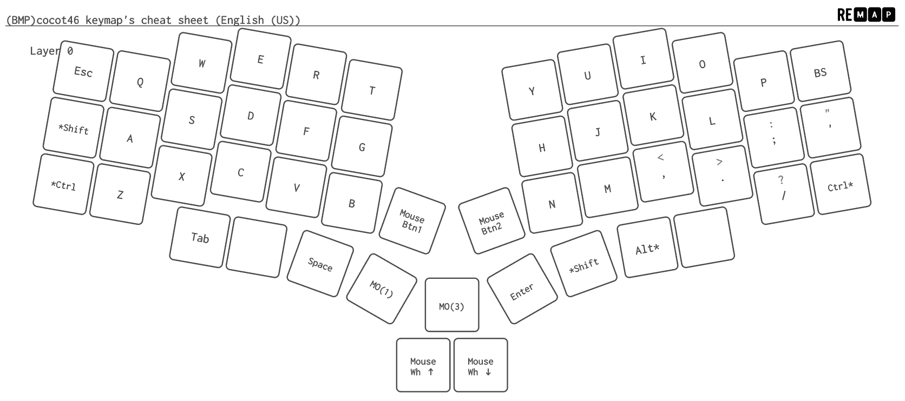
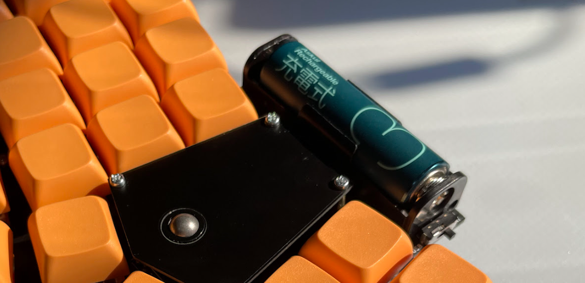
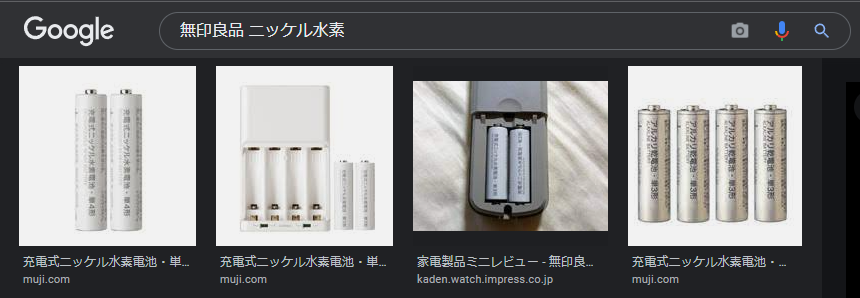
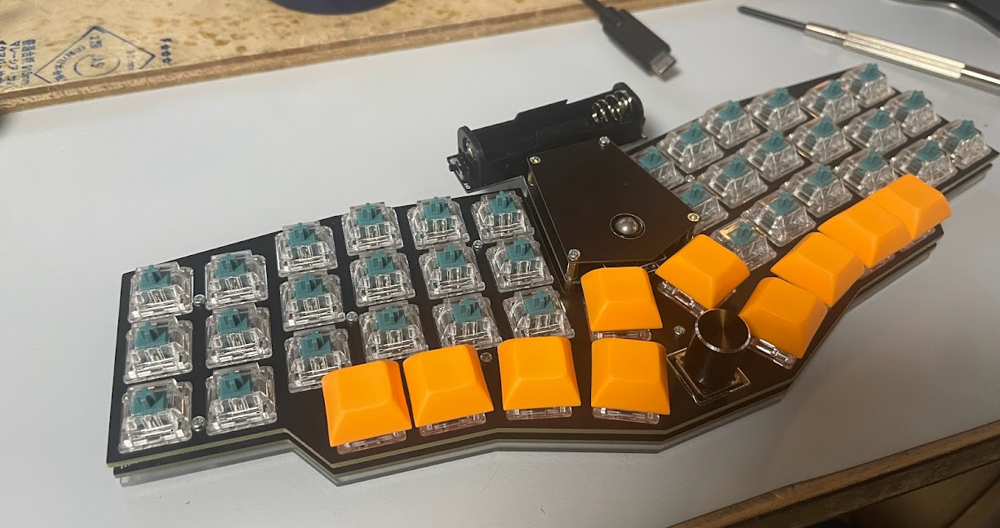
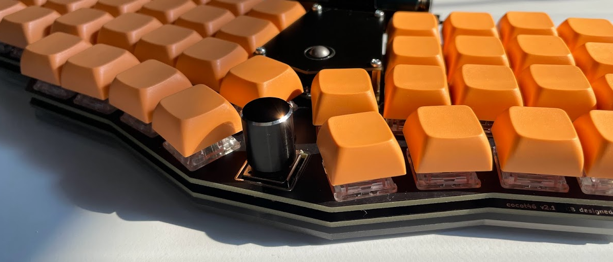

先日、[aki27さん](https://twitter.com/aki27kbd?s=20)の開発したキーボード[cocot46](https://aki27.booth.pm/items/3217515)が再販されていたので、購入させていただきました。ずっと狙っていたくせについうっかりして本命のロープロファイル版cocot46-lpを逃してしまったので滑り込みで無印の方を購入。lpはまた春節明けに追加発注をかけるそうなので今度こそ…

## 一体型のトラックボール付きカラムスタッガード
cocot46は40％配列のキーボードです。自分はLily58をメインで使っているので、一体型で[Lily58](https://shop.yushakobo.jp/products/lily58-pro/)にキー配置が近いものをと探していたところこのキーボードの存在を知りました。真ん中にトラックボールとロータリーエンコーダがついていて、ほぼホームポジションを維持したまま簡単なマウス操作が可能です。

分割キーボードを持ち歩けるように板を作ったんですが、あの板を持ってさすがに「ちょっとカフェで作業するか～」ともいかないので、今のキー配列のまま一体型でコンパクトに扱えるキーボードが欲しかったんです。

親指周りのキー数は一緒ですが、40%キーなので数字キーに当たる一列がまるっとありません。(👆は[Remap](https://remap-keys.app/)で生成したチートシート)コーディングで数字も記号も使うのでさすがに40％は…と敬遠していたんですが、勇気を出して挑戦してみたら案外なんとかなっています。

## 無線化にも対応
中央に電池がついていますが、これは別売りの無線化基板です。Arduino Pro Microを[BLE Micro Pro](https://sekigon-gonnoc.github.io/BLE-Micro-Pro/)に差し替えることで、マウスもキーボードもBluetooth化することができます。これもダメもとチャレンジでしたが、案外サクッと接続できました。iPadで無線接続できるのがありがてぇ… 

電池が丸見えになるので色とフォントが好みのアスクルオリジナル充電池にしてみました。かわいい。探してる時に無印良品の充電池もちょいディストピア感あって良いなと思ったんですが、残念ながらディスコンに。

## パーツ構成

本体に加えて、見た目や操作感に関わるパーツは以下をチョイスしました。

| 品目             | 商品名                                                                                                         | 入手先        |
| ---------------- | ------------------------------------------------------------------------------------------------------------ | ------------- |
| 本体             | [cocot46＋無線化キット](https://aki27.booth.pm/items/3217515)                                                | Booth         |
| マイコン         | [BLE Micro Pro](https://shop.yushakobo.jp/products/ble-micro-pro)                                            | 遊舎工房      |
| キースイッチ     | [DUROCK T1 キースイッチ 67gタクタイル軸](https://talpkeyboard.net/items/5f2a6baf791d021128184c10)            | TALP Keyboard |
| キーキャップ     | [XDA PBT ブランクキーキャップ](https://talpkeyboard.net/mypage/order_history/7319677417)                     | TALP Keyboard |
| 電池             | [アスクルオリジナル 充電式・ニッケル水素電池 単３型](https://www.askul.co.jp/p/J485991/?int_id=recom_DtBalk) | アスクル      |
| エンコーダつまみ | [【-HATA-】ミニノブ 黒色（ミリ）](https://t-nakamura-hata.amebaownd.com/pages/3695253/page_202003271319)     | 畑精密工業    |

普段使いのキーボードは[Gateron静穏55gタクタイル](https://talpkeyboard.net/items/5b9e0ff7ef843f7701000386)を使っているのですが、今回はそこからちょっと重めをチョイスしてみました。色がめちゃ好みで見えなくなるのが惜しい…

10gの違いなのか、静穏キーの違いなのか、 **押してるなっ！** って感じがします。長時間打ち続けたりするとさすがに疲れるのかな…？

エンコーダには、作品用に買ったけど結局使わずじまいだった[畑精密工業](https://t-nakamura-hata.amebaownd.com/)のノブを付けてみました。面取りがシブい

## 使用感

個人的には、手のおさまりが非常に良い感じです。最初の自作キーボードが[Iris](https://shop.yushakobo.jp/products/iris-fr4-plates-set?variant=37665334132897)で、この2年くらいはずっとLily58一本でやってきて、自作キーボードは3台目なので慣れるまで違和感あるかなと思いましたが、始めて触ったとは思えないしっくり感。

数字キーがなく、ちょっとしたマウス操作はトラックボールとエンコーダが使えるので、ほとんどホームポジションから手を動かさなくて良いのが開発作業の時嬉しいです…まだ数字入力に手間取ることがあるので、ガンガン練習していきたい。