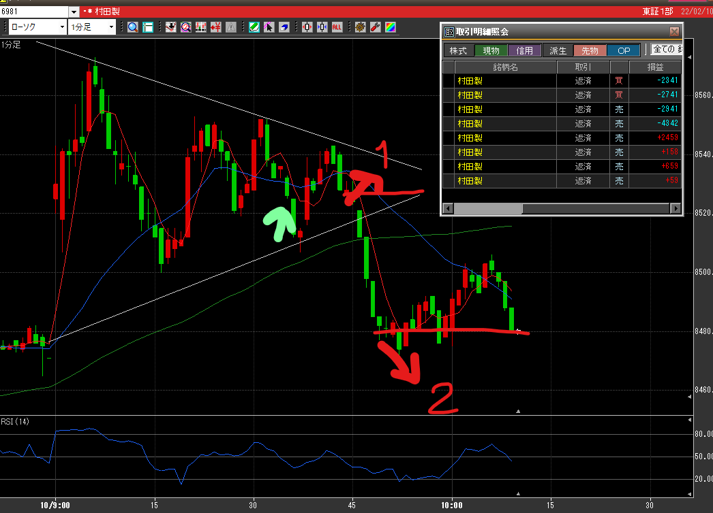

緑矢印は大当てポイント・赤矢印が大外しポイント

### 結果:-9030

- **赤1：** 初手でスイングを当てたが、途中の大きな下げに巻き込まれる。
- **赤2：** そこから下げトレンドと思ったら反転。損切してしまったが、持ってたらプラ転してた

### 考察・心理状態
三角保ち合いのブレイク直前で持ってしまった。これは今までデイでは見えてなかったので、今後見るようにする。

「これ以上下がらないんじゃ？」の所で焦って買いに走ってしまった。1分足なら2連続陽線/陰線でも間に合うから、転換のタイミングはどっしり構えて入るようにする

### 次回から：

2本線同じ陽線・陰線が付いたらその方向にINするようにしてみる。売買方向は、移動平均の方向感で優先度をつける。RSIの警戒もみるようにする。