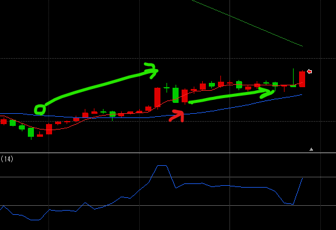
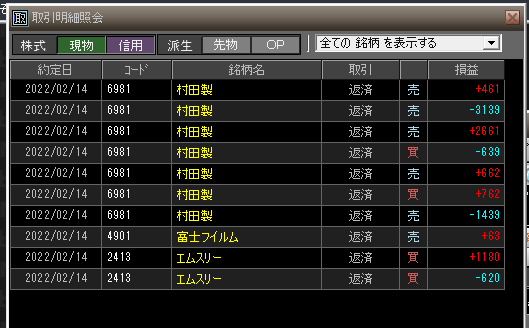

緑矢印は大当てポイント・赤矢印が大外しポイント

### 結果:-9030

- **赤：** 大きく上げたので一旦利確、その後陽線が続きそうで買っちゃって大きく下げた

### 考察・心理状態

2本線INがかなり有効だった。今までだと逃げ売りたくなるようなシーンも、ルールを頼りに持ちこたえることでプラ転できた。今まで数百円の勝ちを重ねていたけど、10Tick20Tickの勝ちを拾えるようになったのはデカい気がする。このルールを軸に強化していけば着実な勝ちが作れそう

### 次回から：

- 2本線INは引き続き。移動平均線をどう捉えるか考たい。
- 逆トレンドの2本線は必ずしもOUT要因にはならない？
- 強く伸びたら売り抜けるのは悪くなさそう。そのあと1本線で戻ったら再度INするで良いかも