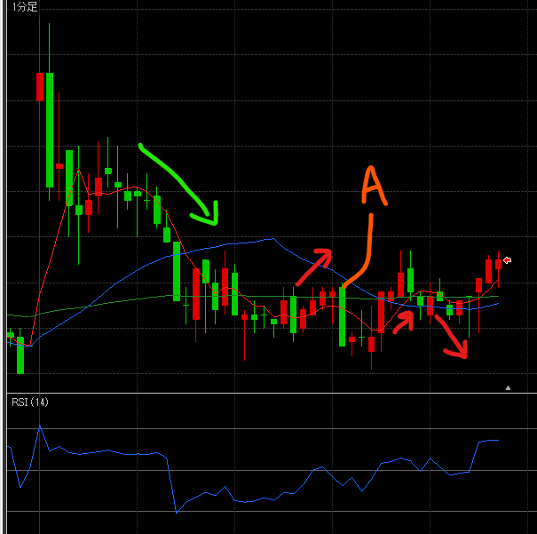
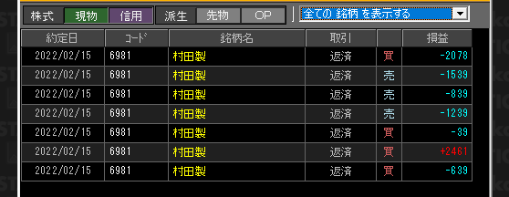

緑矢印は当てポイント・赤矢印が外しポイント

### 結果

- **緑：** さすがに今日は買い続かんだろうと売り。25Tick取れた
- **赤１：** 反発かと思って買いINしたが、その後デカい売りA。移動平均を見るともっと警戒するべきだった
- **赤２：** 今度こそ反発と思いきや、続かず。買いがワンテンポ遅れたのも損をデカくした。 **遅れたらちゃんとあきらめるべき。**
- **赤３：** 取り戻そうという気持ちが出ちゃってた、移動平均を見ると方向感に乏しく、これは入るべきではない。

### 考察・心理状態

出来高が少なかった？なかなか分足が次に出てこなかったし、ひげも全体的に長く、値動きも荒っぽかった気がする。出来高の多そうな銘柄をちゃんと見つけるようにしないとだめかも。

**心理面では、ルールをしっかり決める事で、損失時のダメージがかなり減ったように思う。** ルールに則った損は期待値の範囲で仕方無いし、つい自分で判断した分はルールを破った結果なのでそれも仕方なく感じられる。

### 次回から：

- 買えなかったところは、ちゃんとあきらめる。
- 移動平均線のトレンドをちゃんと検証する。
- 始めの10分で、動きのある銘柄を選別する時間を作る