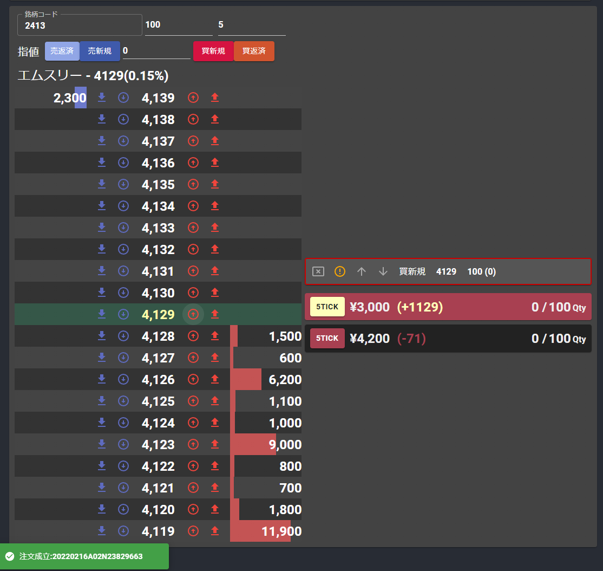
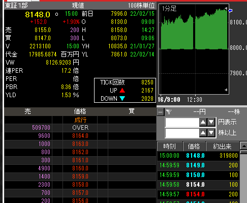
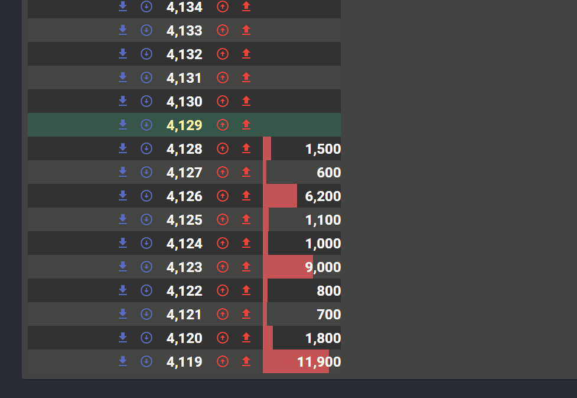
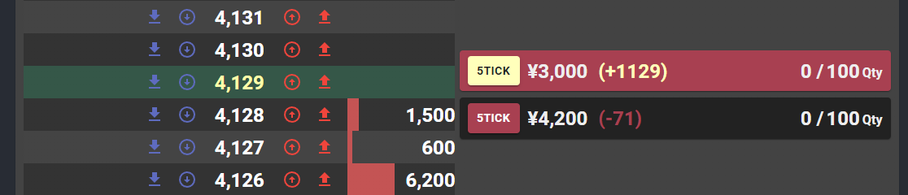

去年くらいから急に株式市場に興味が湧いてきました。今はつみたてNISAと、いくつかの現物を持ちっぱなしで眺めながら、一日1時間くらい自分の発注アプリを使ったデイトレをやったりしています。仮想通貨とNFTは完全に乗り遅れました。

## トレードソフトがあんまり合わない



色々ソフトがあるんですが、基本👆のように網羅的に情報がドバっと出てくる感じで識字能力低めの自分には使いづらく、指値を入力してるうちに何度も板を逃したりしてしまったので、ReactとElectronで売買ツールを作ることにしました。

## kabuステーションAPIと連携

自分が調べた時点ではリアルタイムに板情報の取得と発注ができるのが[auカブコム証券のkabuステーションAPI](https://kabu.com/company/lp/lp90.html)くらいしか見当たらなかったので、ここを使っています。

裏でkabuステーションというトレードソフトを立ち上げておき、ローカルでAPIを叩いて情報取得や発注をかける仕組みになっています。なのでチャートや歩み値はkabuステーションの方で見ます。歩み値もWebsocketで取得出来てほしいなぁ…



注文数量は上の方にテキストボックスを用意して、値段の横のボタンで買いと売り両方入れるようにしました。右側に注文リストが表示されるので、取り消すか、注文が約定すれば消えます。

Snackbarを初めて使ってみたんですがアプリっぽさが急に出て楽しい。何でSnackbarって言うんだろ。こういう名前って誰が決めてるんだろう。ハンバーガーメニューとか

## ポジション表示も一目で分かるように



約定すると、ポジションが板の横に表示されます。保有価格と、含み損益が出ます。金額にするとポジションを大きくした時に余計な感情が入りそうなので、Tick数を表示するようにしてます。左のボタンは指定のTick数上で指値を入れる「とりあえず利確ボタン」

含み益は黄色でめでたく、含み損は黒背景で見やすくしました。**Notionの見出しとかも色が付いてないと全然情報が入ってこない** 事があるので、やっぱり自分は文字だけで読むのが苦手なんだと思います。

そういう情報の取捨選択ができて、余計な考えを減らせるのも自作ツールの良いところだと思いました。

**これはもちろんダミーのポジションですよ。** こんくらいドカッと儲けたい

## 板の呼値を並べるのが難しかった

注文出したり、情報取ってきたりは典型的なREST APIなので地道に作っていったらできたんですが、板表示が地味にしんどかった…

[注文できる値段、呼値](https://www.jpx.co.jp/equities/trading/domestic/07.html)を板に並べていくわけなんですが、これが値段ごとに0.1->0.5->1->1->5->10->10...みたいに変速的だし、なおかつTOPIX構成銘柄かどうかでも刻み方が変わるという…

👇は呼び値テーブルを作って、現在値から下10個分の呼び値を拾ってくるメソッド。Pricegroupというプロパティで呼値グループが返ってきます。先物とか入れるともっと色々あるらしいんですが株式は2種類でok。なんかもっと賢いやり方がありそうだけど、まぁ動いているのでヨシ

```typescript
//呼び値コードの閾値価格と、呼び値単位
const pr_10000_border=[3000 , 5000  , 30000 , 50000 , 300000, 500000];
const pr_10000_unit = [1    , 5     , 10    , 50    , 100   , 500   ];
const pr_10003_border=[1000 ,3000   , 10000 , 30000 , 10000 , 30000 ];
const pr_10003_unit = [0.1  , 0.5   , 1     , 5     , 10    , 50    ];

export const getUnderPrice =  (price: number, rangeGroup: string, num: number = 10): Array<number> => {
	let arr: Array<number> = [];

	const pr_border = rangeGroup === "10003" ? pr_10003_border : pr_10000_border;
	const pr_unit = rangeGroup === "10003" ? pr_10003_unit : pr_10000_unit;

	let nextPrice = price;

	for (let i = 0;i < num;i++)
	{
		let breaker = false;
		pr_border.forEach((b, idx) => {
			if (nextPrice >= b) {}
			else if (!breaker)
			{
				nextPrice = Math.round((nextPrice - pr_unit[idx]) * 10) / 10;
				breaker = true;
			}
		})

		arr.push(nextPrice);
	}

	return arr;
}
```

何でもoFでやったれ期の時にoFで作ってた時期もあったんですが、非同期処理辛いしこういうのはReactで作るのが一番良いですね、、UIコンポーネントもmuiで書いておけばある程度小ぎれいにまとまってくれるので本当に助かる。