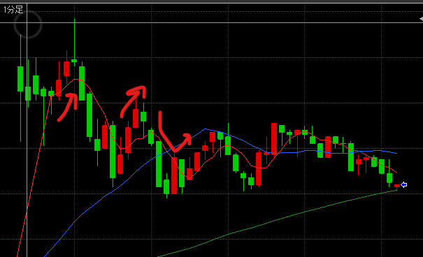
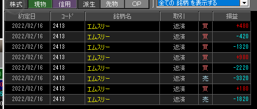

緑矢印は当てポイント・赤矢印が外しポイント

### 結果

- 特別気配のエムスリーにしてみたけど、売買高そこまで伸びず？
- すぐ15Tickくらいまでプラスになるも、反発がすぐで利益を取りそびれた

### 考察・心理状態

2本線自体はやっぱり悪くない。1本は続くので、すぐに10Tickにいくようなら利確しちゃっても良いのかも。一時反発の2本線なのか、トレンド転換なのか。長く続くのかどうかを見極めるべし

行けると思ったらあんまりうまくいかなくてそろそろつらくなってきたけど、ここが踏ん張りどころかもしれない。

### 次回から：

- 1回のINで10Tickを目途に細かく利益を重ねるようにする
- 動きのある銘柄調査はもうちょっとやる