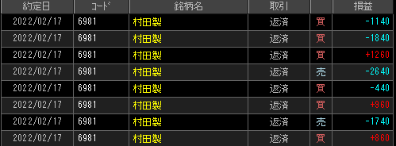

緑矢印は当てポイント・赤矢印が外しポイント

### 結果

- 2本線の伸びですぐ反転しちゃう感じだった
- 水色当たりの「怪しい2本線」は察知できたものの、外す方が多い

### 考察・心理状態

板が薄いと勢いが続かずに反転しちゃう。銘柄を変えるべきか？村田7000円台なので、確かにかなり高い。
振り返りでは行けてそうなのにダメということは、何か見落としてるのかもしれない。

### 次回から：

- 住友金属鉱山・SUMCO・KDDI・モノタロウ当たりを狙おう