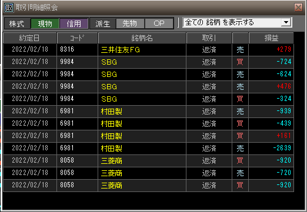

### 結果

- 銘柄が決めきれなかったりしてグダグダ
- 2本線作戦も効かず。。

### 考察・心理状態

2本線で機械的にINしてはダメかもしれない。「トレンド転換の順張り」になってるかどうか、移動平均とRSI、板、日経平均から判断しないとだめなのかも。

2本線で行けると思っていたので、気持ち的にかなりキツクなってきた。無理して早起きしてやるより、午後1時間とかにした方が気持ち的にも続きそうかも。とにかく土日は一旦リフレッシュする

### 次回から：

- 2本線はＩＮの最低ラインとする。ローソクがパターン作りそうなら、RSI・移動平均・板を見て考える
- 14時半からの1時間とかにするか？