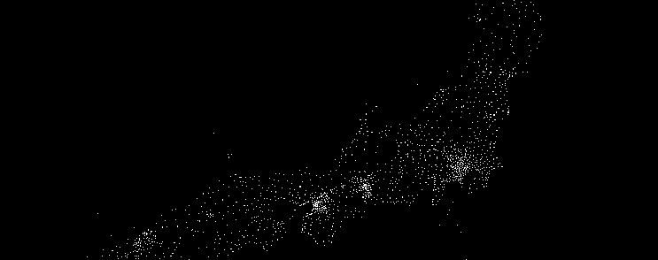
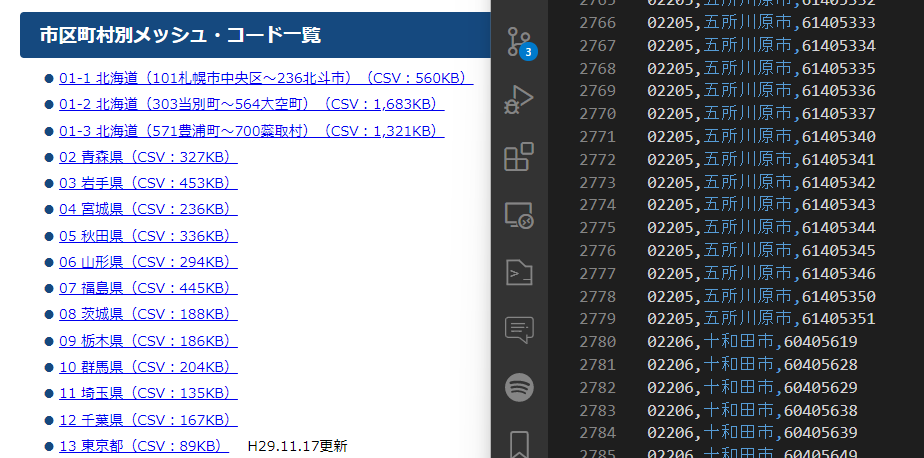
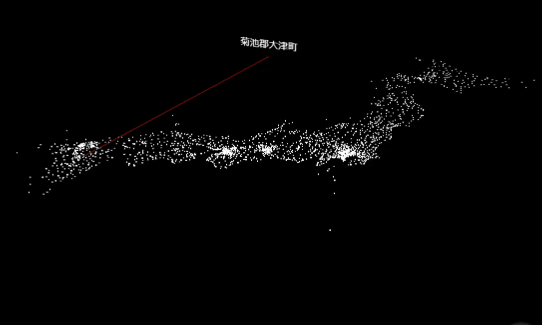

全国の市区町村には、全国地方公共団体コードという番号が振られています。この番号を元に市区町村の位置をプロットすれば、[政府統計](../220204_estat)の汎用データビジュアライズできんじゃね！？とアガったんですが「この市区町村はこの辺」というエリアコードと位置に関するザックリしたデータが見つけられず。

## メッシュコードから、大まかな中心位置を割り出す

[総務省統計局](https://www.stat.go.jp/data/mesh/m_itiran.html)のページに、市区町村コードと地域メッシュ・コードの対応が表記されているCSVのリストがあったので、これをパースして市区町村の大まかな位置をパースすることにしました。

メッシュ・コードというのは、国土を緯度経度に基づいて分割し、6桁の数字を割り振ったコードだそうです。上記リンクには「各エリアコードの地域が含むメッシュコード」の一覧が記載されているので、今回はメッシュコードから作ったバウンディングボックスの中心を、ザックリ市区町村の位置として使うことにしました。

#### もっと良いデータがあったかもしれない

ちなみに[国土交通省のページ](https://nlftp.mlit.go.jp/index.html)にもGISという地理データが公開されてるんですが、境界線のポリゴンなのでちょっと情報量が多いし今回の用途には合わず。記事を書いてる段階で「位置参照情報」というデータの存在に気づいて「こっちの方が楽じゃね…？」と思ったんですが、なぜか2/19日現在サーバーがダウンしているので確認できず。。こっちのデータを利用しても良いのかもしれません。

## CSVを全部ダウンロードする


北海道3ファイル、1都府県1ファイルの計49ファイルのCSVになっているので、ダウンロードします。
中身はシンプルで、エリアコード、市区町村名、その市区町村が含まれるメッシュコードが並んでいます。

## メッシュコードから、緯度経度を計算

メッシュコードから緯度経度はシンプルな計算で割り出せるので、node.jsで以下のような関数を用意して変換します。メッシュコードの内容と計算方法は[こちら](http://white-bear.info/archives/1400)を参考にしました。

```js
//緯度
const getLatitude = (meshCode) => {
	const first_lat  = parseInt(meshCode.toString().slice(0, 2));
	const second_lat = parseInt(meshCode.toString().slice(4, 5));
	const third_lat  = parseInt(meshCode.toString().slice(6, 7));
	
	let latitude = first_lat / 1.5 + second_lat * 5.0 / 60.0 + third_lat * 30.0 / 3600.0;
	
	return latitude;
}

//経度
const getLongitude = (meshCode) => {
	const first_lon  = parseInt(meshCode.toString().slice(2, 4));
	const second_lon = parseInt(meshCode.toString().slice(5, 6));
	const third_lon  = parseInt(meshCode.toString().slice(7, 8));

	let longitude = first_lon + 100 + second_lon * 0.125 + third_lon * 0.0125;

	return longitude;
}
```

## 緯度経度のバウンディングボックスを作る

あとは東西と南北の端を割り出して、真ん中の座標を定義してあげれば各エリアコードのざっくり中心位置が割り出せます。こんな感じ。

```js
const iconv = require('iconv-lite');
const fs = require('fs');
const {parse} = require('csv-parse/sync');

const generateAreaMeshConv = (path) => {

	//データがShift_JISなので変換する
	const data = fs.readFileSync(path);
	const sjis = iconv.decode(data, "Shift_JIS");
	const records = parse(sjis, {columns: true,});
	
	let dict = {};
	
	//CSVのメッシュコードから緯度経度を算出し、端を見つける
	for (r of records)
	{
		const areaCode = r['都道府県市区町村コード'];
		const meshCode = r['基準メッシュコード'];
		const lonTmp = getLongitude(meshCode);
		const latTmp = getLatitude(meshCode);
	
		let area = {};
		if (dict[areaCode] === undefined)
		{
			area = {
				name: r['市区町村名'],
				lonMax: 0,
				lonMin: 200,
				latMax: 0,
				latMin: 90,
				lon: 0,
				lat: 0,
			};
		}
		else
		{
			area = dict[areaCode];
		}
	
		area.lonMax = Math.max(area.lonMax, lonTmp),
		area.lonMin = Math.min(area.lonMin, lonTmp),
		area.latMax = Math.max(area.latMax, latTmp),
		area.latMin = Math.min(area.latMin, latTmp),
	
		dict[areaCode] = area;
	}
	
	//中間地点を定義し、端のデータを消す
	for (key in dict)
	{
		const d = dict[key];
		
		{
			d.lon = (d.lonMax + d.lonMin) / 2.0;
			d.lat = (d.latMax + d.latMin) / 2.0;
			delete d.lonMax;
			delete d.latMax;
			delete d.lonMin;
			delete d.latMin;
		}
	}

	return dict
}

const data = {};
Object.assign(data, generateAreaMeshConv('mesh_csv/01-1.csv'));
Object.assign(data, generateAreaMeshConv('mesh_csv/01-2.csv'));
Object.assign(data, generateAreaMeshConv('mesh_csv/01-3.csv'));

for (let i = 2;i <= 47;i++)
{
	const path = 'mesh_csv/' + i.toString().padStart(2, '0') + ".csv";
	Object.assign(data, generateAreaMeshConv(path));
	console.log('calc ' + path + ' ...');
}

fs.writeFileSync('./assets/areaMeshConv.json', JSON.stringify(data, null, 4));
```

json形式で吐き出せば、色々と使いやすい市区町村と緯度経度一覧の完成です。1万くらいあるのを覚悟してましたが、意外と2500くらいでした。このデータも200kbちょいくらいです。

```json
{
    "10201": {
        "name": "前橋市",
        "lon": 139.1125,
        "lat": 36.43333333333333
    },
    "10202": {
        "name": "高崎市",
        "lon": 138.88125,
        "lat": 36.3375
    },
    "10203": {
        "name": "桐生市",
        "lon": 139.3125,
        "lat": 36.475
    }, 
	...
```

これをビジュアル系のフレームワークに処理させてあげれば、市区町村のポイントクラウドが作れます。色々なデータビジュアライズが捗りそう。


