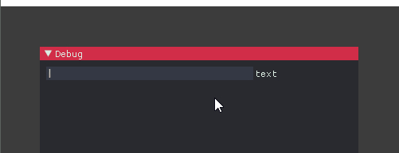
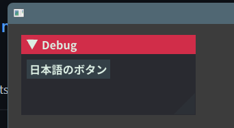
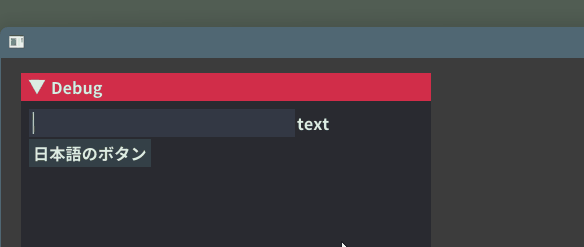
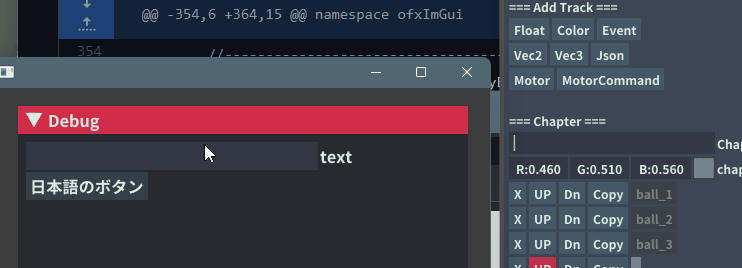

openGL環境下でのGUIとして便利な[imgui](https://github.com/ocornut/imgui)をopenFrameworksで扱えるアドオン、[ofxImGui](https://github.com/jvcleave/ofxImGui)をよく使っているのですが、そのままだと日本語入力ができません。自分が調べた時は[こちらの記事にヒット](https://qiita.com/hiz_/items/b02a218eaeb63023c6b2)して、詳しくは理解できていないのですがGLFWとの絡みやらなんやらで、対応していないとのこと。



こんな感じで、IMEが立ち上がっても何も起きません。

ですが、ここに引用されているIssueなどから色々引っ張ってきた結果日本語表示＋IMEによるインプットができるようになりました。oF使ってる人との話の中で度々その話題になるので、備忘録としてここにメモしておきます。自分が扱った環境は以下のとおりです。

| 環境  | バージョン              |
| --- | --------------------------- |
| openFrameworks  | v0.10.0~0.11.0              |
| IDE | VisualStudio Community 2019 |
| OS  | Windows 10/11               |

※4年くらい前のソリューションを現在のofxImGui-masterブランチで動くか確認した記事です。なので今はもっと別のやり方があるかも！**とりあえず動かしたいんじゃ、な人向け**

## まずシンプルに日本語を表示する

日本語を表示するだけならわりとシンプルです。フォントをロードする方法があるので、日本語を含むフォントを用意して、使うフォントの範囲を`ImFontAtlas::GetGlyphRangesJapanese()`で日本語に設定します。フォントサイズも設定可能。

```cpp
//gui は ofxImGui::Gui
void ofApp::setup(){
    int fontSize = 24;
    ImGuiIO& io = ImGui::GetIO();

	io.Fonts->AddFontFromFileTTF(
        ofToDataPath("fonts/NotoSansCJKjp-Bold.otf").c_str(),
        fontSize, 
        NULL, 
        io.Fonts->GetGlyphRangesJapanese()
    );

    gui.setup();
}
```

あとは日本語をUTF-8リテラルを指定して、いつも通りImGuiを使えば良いだけです。注意点として、**ソースコードのエンコーディングはBOM付きのUTF-8である必要があるようです。**

```cpp
void ofApp::draw(){
    gui.begin();
    ImGui::Button(u8"日本語のボタン");
    gui.end();
}
```



無事日本語のボタンが表示されました。

## 日本語入力を受け付けさせる

これで日本語の表示はできますが、TextInputなどではまだ日本語テキストの入力ができません。ウィンドウに対するテキスト入力がImGuiに渡っていないためなので、コールバックを以下のような感じで仕込んであげます。

```cpp
void ImGui_ImplGlfwGL3_CharCallback(GLFWwindow*, unsigned int c)
{
	ImGuiIO& io = ImGui::GetIO();
	if (c > 0 && c < 0x10000)
		io.AddInputCharacter((unsigned short)c);
}

//--------------------------------------------------------------
void ofApp::setup(){

    auto ptr = static_cast<ofAppGLFWWindow*>(ofGetWindowPtr());
	glfwSetCharCallback(
        ptr->getGLFWWindow(), 
        ImGui_ImplGlfwGL3_CharCallback
    );

    //...以下略(上のofApp::seutpと同様)
```

あとは`ImGui::InputText`でこう

```cpp
char buf[1024] = {0};

void ofApp::draw(){

    gui.begin();
    ImGui::InputText("text", buf, 1024);
    ImGui::Button(u8"日本語のボタン");
    gui.end();
}
```

するとこんな感じで、日本語がテキストボックスに入力されます。日本語と英語の切替も可。



## アルファベットが2度入力される問題

textInputに日本語が入るようになりました。なりましたが、上の入力では半角英数入力の時にアルファベットが2回ずつ入力されてしまっています。これはなんかダーティな気がしますが、`ofxImGui/src/EngineGLFW.cpp`の`EngineGLFW::onKeyPressed`を最初の方だけ以下のように書き換えます。

```cpp
	void EngineGLFW::onKeyPressed(ofKeyEventArgs& event)
	{
		bool needReturn = false;
		needReturn |= (33 < event.key) && (event.key < 127); // Alphabet
		needReturn |= (event.key < 0); //japanese
		needReturn |= event.key == OF_KEY_RETURN;

		if (needReturn) return;

        //以下通常のコード
		int key = event.keycode;
		ImGuiIO& io = ImGui::GetIO();
```

ダブってしまうキーコードだけonKeyPressedが2度呼ばれてしまうので、はじくようにしました。これでほぼ通常のテキストボックスに近い感覚でImGuiでもテキスト入力ができるようになったかと思います。

## 変換候補などの位置について



これで日本語入力ができるようになったんですが、本当は入力中の位置にテキストが来てほしいんですよね…以前(右側)は以下のコードをsetupに入れてあげるといけていたんですが、今日(2022-02-25時点)のofxImGuiおよびimguiでは`ImeWindowHandle`は廃止されたっぽくてできませんでした。`PlatformHandleRaw`に指定してくれよな！というコメントがあったのでやってみたんですがうまくいかず…やり方探してます。

```cpp
    //前はこれでいけてた
	io->ImeWindowHandle = ofGetWin32Window();

    //こうなのか…？うまくいかず
    ImGui::GetMainViewport()->PlatformHandleRaw = (void*)ofGetWin32Window();

```