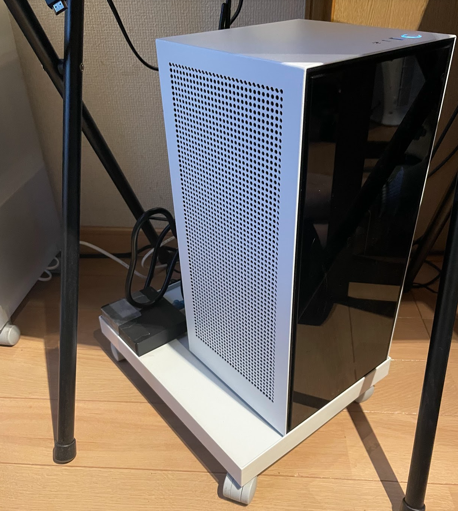
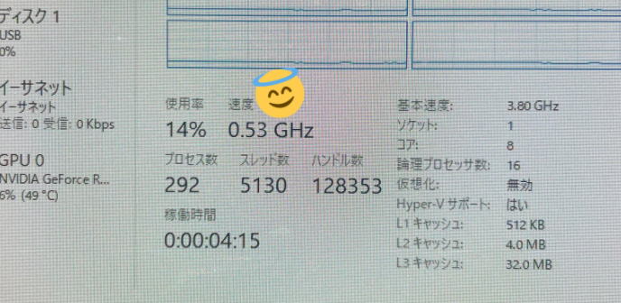
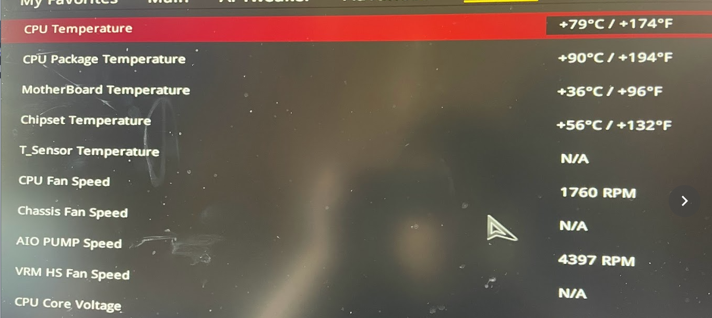
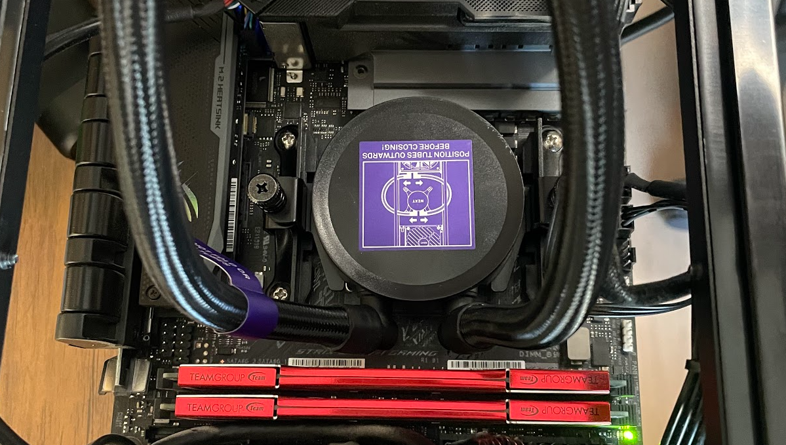
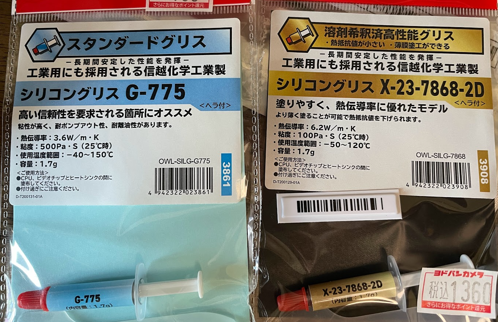
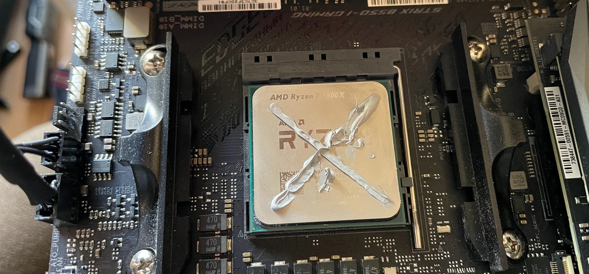

---
title: NZXT  H1の水冷が蒸発しちゃったかも
date: "2022-02-27T12:07:39+0900"
image: "content/blog/220227_nzxt_cooler/2022-02-27-12-19-22.png"
thumbnail: "2022-02-27-12-19-22.png"
tags: ["openFrameworks"]
---

自宅作業用PCとしてNZXTのH1を使っています。

縦に細長い形状でRTX30シリーズもギリ入るし、パネルが全て下にあって抜き差しのしにくさを犠牲にすれば、ケーブル類もスッキリするので良い感じです。

白色だと、無印良品の「キャスターもつけられるフタ」を付けるとなんか合ってて良い。裏のスペースにはLANハブが設置されています。

<iframe style="width:120px;height:240px;" marginwidth="0" marginheight="0" scrolling="no" frameborder="0" src="//rcm-fe.amazon-adsystem.com/e/cm?lt1=_blank&bc1=000000&IS2=1&bg1=FFFFFF&fc1=000000&lc1=0000FF&t=culminate0523-22&language=ja_JP&o=9&p=8&l=as4&m=amazon&f=ifr&ref=as_ss_li_til&asins=B07XWYKKYD&linkId=624135eab15b63b2895e48fb81a98724"></iframe>

<iframe style="width:120px;height:240px;" marginwidth="0" marginheight="0" scrolling="no" frameborder="0" src="//rcm-fe.amazon-adsystem.com/e/cm?lt1=_blank&bc1=000000&IS2=1&bg1=FFFFFF&fc1=000000&lc1=0000FF&t=culminate0523-22&language=ja_JP&o=9&p=8&l=as4&m=amazon&f=ifr&ref=as_ss_li_til&asins=B086TGKDN6&linkId=7a2181b76f292fa33b739630b92c2c8b"></iframe>

## ある日突然CPUが熱暴走

1年以上普通に使っていて、[関ヶ原合戦図の作品](https://backspace.tokyo/works/sekigahara-sansuizu/)でHoudiniなんかもガンガン回していたんですが（今思えばアレがかなりダメージを与えていたのか…）ある日突然CPUクロックが0.5GHzとかに落ちて何も出来なくなり、やがて熱暴走っぽくプチンとシャットダウンしてしまいました。

色々調べていくと、BIOS設定画面なのにCPU温度がどんどん上昇していってやっぱり熱暴走で死んでしまいます。水冷が動いてない？？と思ったんですが、AIO_PUMPのケーブルを抜き差しすると多少それに反応して上下はします。

## とりあえずできる対策

そうなると液がダメになったとか、蒸発しちゃったのか…？と思うわけですが、この時点では確かめる方法も無いので、とりあえずグリスだけでも変えるか…と新宿へ買い出し。

経済ニュースで聞くイメージしか無かった信越化学工業、グリス作ってるのか…と謎に感動して買ってしまった。

対角線が良いと聞いたので塗ってみます。まぁまぁ良くなったけど、まさに焼け石にグリスって感じで根本解決にはなって無さそうな感じ…

これ以上できることは無さそうなのでとりあえずメーカーに問い合わせ、諦めてしばらくは空冷で凌ぐことにしました。

## その後Twitterで詳細な情報をいただく

<blockquote class="twitter-tweet">
外失礼 冷却液が適正値なら4300は回らないので蒸発しちゃってますね（私もそうでした  空冷で凌げるならメーカー保証の返信待ちましょう  保証期間過ぎていたり購入証明無しならなら引用のツリーの上の方から参考にしてみて下さい <a href="https://t.co/Cwx4RvOWau">https://t.co/Cwx4RvOWau</a>
&mdash; Teo_Pazu (@Pazz_Teo) <a href="https://twitter.com/Pazz_Teo/status/1497532296316198913?ref_src=twsrc%5Etfw">February 26, 2022</a></blockquote> 

過程を色々ツイートしていたところ、親切な方から同じ状況になったという情報をいただくことができました。ポンプの回転数が4300rpmくらい出ているので、おそらく液が蒸発しているだろうとのこと。

この方のツイートスレッドを見ているとかなり近い状況で、Core-i9 9900Xの発熱量に耐えられず蒸発した模様。自分はRyzen7 5800XでHoudiniの群衆シミュレーションとか回していたのでそれがよくなかったのかもしれない…

でも何となく温度センサの異常とか、他が原因じゃなさそうなことが分かったので良かったです。簡易水冷は中がどうなってるか分からないの難しいっすね、、ポンプの回転数から液量を推測するというのは知らなかった。

ちなみにこんな感じの構成です。確かに排熱のこと考えなさすぎなのかもしれない。。

| 部品名             | 型番                    |
| ------------------ | ----------------------- |
| マザーボード       | ROG STRIX B550-I GAMING |
| CPU                | AMD Ryzen 7 5800X       |
| グラフィックボード | GIGABYTE RTX3070 VISION |
| メモリ             | Team DDR4 3200Mhz PC4-25600 |

<iframe style="width:120px;height:240px;" marginwidth="0" marginheight="0" scrolling="no" frameborder="0" src="//rcm-fe.amazon-adsystem.com/e/cm?lt1=_blank&bc1=000000&IS2=1&bg1=FFFFFF&fc1=000000&lc1=0000FF&t=culminate0523-22&language=ja_JP&o=9&p=8&l=as4&m=amazon&f=ifr&ref=as_ss_li_til&asins=B097F3ZHKR&linkId=79ccf14b034b3fae40bb235e3a23b919"></iframe>

<iframe style="width:120px;height:240px;" marginwidth="0" marginheight="0" scrolling="no" frameborder="0" src="//rcm-fe.amazon-adsystem.com/e/cm?lt1=_blank&bc1=000000&IS2=1&bg1=FFFFFF&fc1=000000&lc1=0000FF&t=culminate0523-22&language=ja_JP&o=9&p=8&l=as4&m=amazon&f=ifr&ref=as_ss_li_til&asins=B08MFDSFHT&linkId=f19854915bc8b2862653bd6b84d17140"></iframe>

<iframe style="width:120px;height:240px;" marginwidth="0" marginheight="0" scrolling="no" frameborder="0" src="//rcm-fe.amazon-adsystem.com/e/cm?lt1=_blank&bc1=000000&IS2=1&bg1=FFFFFF&fc1=000000&lc1=0000FF&t=culminate0523-22&language=ja_JP&o=9&p=8&l=as4&m=amazon&f=ifr&ref=as_ss_li_til&asins=B089Y8YXP6&linkId=7f359f2aa5a9df451cce775fee63bc11"></iframe>

<iframe style="width:120px;height:240px;" marginwidth="0" marginheight="0" scrolling="no" frameborder="0" src="//rcm-fe.amazon-adsystem.com/e/cm?lt1=_blank&bc1=000000&IS2=1&bg1=FFFFFF&fc1=000000&lc1=0000FF&t=culminate0523-22&language=ja_JP&o=9&p=8&l=as4&m=amazon&f=ifr&ref=as_ss_li_til&asins=B084RDPTPZ&linkId=a20a06954e1745c17b1f416deede31cb"></iframe>