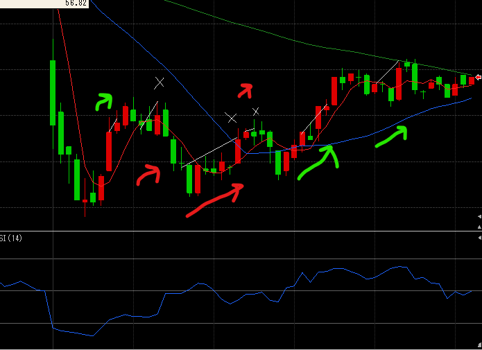
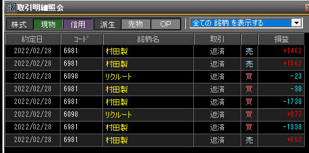

---
title: トレード 2/28(+1426)
date: "2022-02-28T09:53:25+09"
image: "220228_trade/chart.png"
thumbnail: chart.png
tags: ["trade"]
---

### 結果:+1426

- 損もあったけど、一進一退でなんとか勝ちも拾えた

### 考察・心理状態

- かなり休んで久々の寄り。稼ぐぞー！みたいな気持ちが少なく、フラットな気持ちでのぞめてたかも。こういう精神状態が大事？平常心
- 赤1・3の売りはもう少し耐えてればどちらも大きく取れてたが、ここを察知する方法はあるかどうか。

### 次回から：

1・2分で焦って決断を出してしまう。現在時刻/2くらいのタイムスパンを意識。入ったら、どこまで伸びそうかを意識する。どこまで含み損を許容するかも然り。