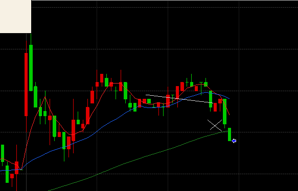

### 結果:-220

- 移動平均の反発で買い。一時下がるもヒゲを頼りに持ちこたえて一時＋6Tickくらいまで行ったけど、あと1円のところで売れず下落、-2で損切り。

### 考察・心理状態

- 2・3分のところで売りそうになっちゃったけど、プラスまでちゃんと耐えることができた。
- あと1円のところで売り抜けられなかった。判断ミスかたまたまなのか…板が読めればわかる？
- この損切の後大きく下落していたので、リスク回避ちゃんと出来てる

- 仕事の連絡が入ってて返信待ちで集中できなかったので、取引は一回のみ。切り替える力大事（とはいえ先方現場なので仕方ない…？）

### 次回から：

- 前日同様、どこまで上がりそうかの目途をしっかり狙えるようにする。