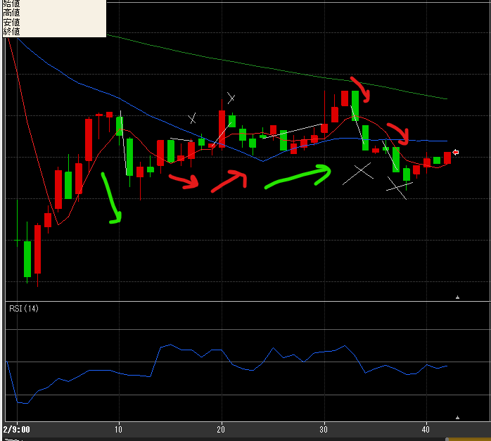
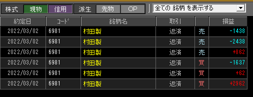

---
title: トレード 3/2(-1627)
date: "2022-03-02T09:41:59+09"
image: "220302_/image.png"
thumbnail: chart.png
tags: ["trade"]
---

### 結果:-1627

- 初手で30Tick拾えたが、その後いまいち。2勝4敗

### 考察・心理状態

- 初手はヒゲから移動平均の反発をうまくとらえた？
- 3本目の高値ブレイクは、丁度20分だったので注意するべきだった
- 4本目の勝ち。謎の大量買いがなければ勢い続いてなかったかも。妥当か
- そこから伸びる？と思って買いINしたけど急落。25と75の形で注意できたのかも

### 次回から：

- 25分(青）と75分(緑）の向きがハッキリそろってない時は要注意。
