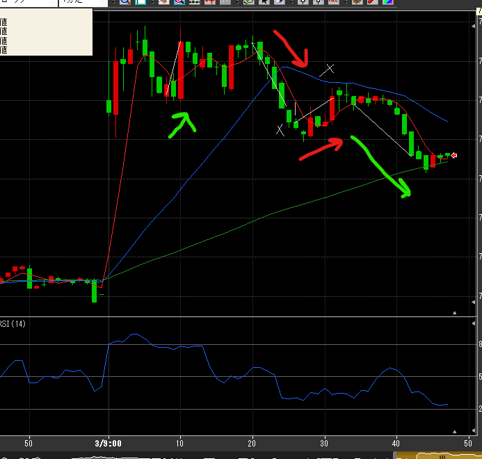
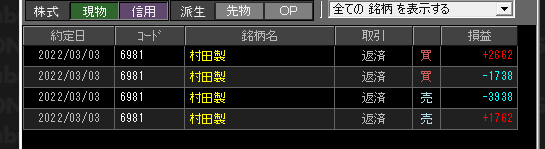

---
title: トレード 3/3(-1252)
date: "2022-03-03T09:46:06+09"
image: "220303_/image.png"
thumbnail: chart.png
tags: ["trade"]
---

### 結果:-1252

- 10分から今日は強いかなと、戻ってきたところで買い
- 20分のところでも反発かと思いきや、一気に戻されて大けが
- 慌てて売りで入るも反発…その後移動平均の売りでちょっと回収

### 考察・心理状態

20分からが魔の時間すぎる。読めるようになるまでは大人しくしておくのが良さそう。20分からの所は損切もできなかった。ちゃんと損切ができていればプラスで終えてた可能性もある

7800を境に大量の買い入れが3回あった。こういう動きは今まで観測できてなかった。

30分～の売りは移動平均を根拠にしっかり耐えて、大きな利益を取れた。抜けるタイミングもまぁまぁ妥当っぽい（この後横横～上がっている）

### 次回から：

- 20～25分は見るだけにする