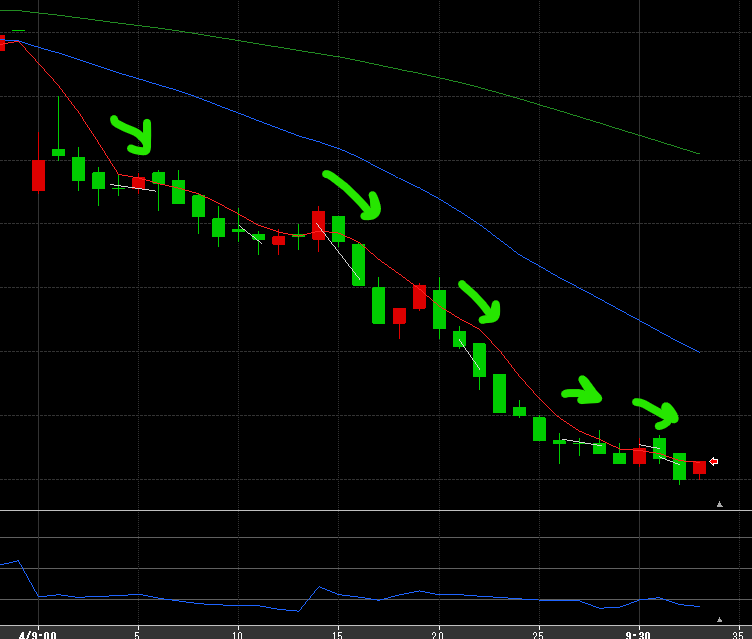

---
title: トレード 3/4(+5141)
date: "2022-03-04T09:34:49+09"
image: "220304_/image.png"
thumbnail: 2022-03-04-09-35-44.png
tags: ["trade"]
---

### 結果:

- 反発しそうなところを警戒しつつ、売りのみでIN。大きく全勝！

### 考察・心理状態

- 自宅でトレード。頭はわりとシャッキリしてた
- 反発もなく売っときゃ勝てる地合いだった。反発にビビってすぐ出ちゃったけど、これくらいビビってた方がリスクヘッジとして多分良いんだと思う。
- 「全然買いが続かないぞ…？」みたいは気配はわりと早い段階で板から感じ取れたように思う。情勢もあるし、地合いボーナスかなぁ

### 次回から：

- 売り続き・買い続きを早く判断して、大きく取れるようにしたい
- こんな地合いあんま無いと思うから、次はスイングに警戒