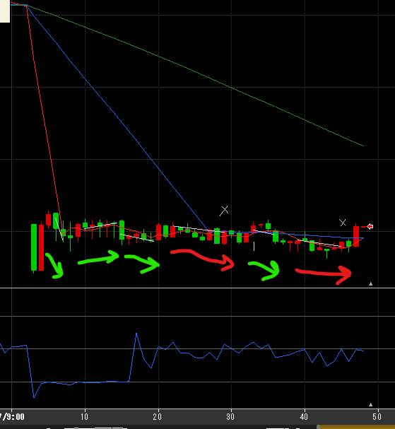
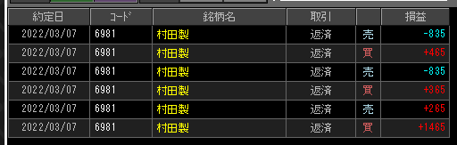

---
title: トレード 3/7(+890)
date: "2022-03-07T09:50:41+09"
image: "220307_/image.png"
thumbnail: 2022-03-07-10-07-20.png
tags: ["trade"]
---

### 結果:+890

- 横横のスイングをじっくり置いて勝ちを重ねた。

### 考察・心理状態

- 20Tickのマイナスに惑わされずに耐えれたのかも（損切できてないだけ？）
- 7200行くやろ、と思って置いた最後の赤(買7188->7180)はあと2分待ってたら当初の狙いで売れてた…悔しい。けど逆に行く可能性もあったわけだから、損切りできたと捉えよう
- 個別悪材料があるわけでもない状態で-4~5%以上はやっぱり下げにくいか？今回ヨコヨコをプラスで終えたけど、トレンドの変わり目が読みづらいので引き続き警戒する

### 次回から：

- 高値INを我慢する。強いトレンドなら一度下げてからでも遅くないので、ちゃんと狙いのトレンドから一服するまで待つ