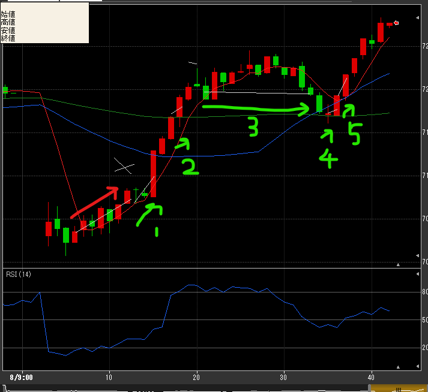

---
title: トレード 3/8(+4258)
date: "2022-03-08T09:41:35+09"
image: "220308_/image.png"
thumbnail: chart.png
tags: ["trade"]
---

### 結果:

- 初動で10Tick勝ち後、5分辺りで売りで入るも30Tick損
- 反発トレンドと判断して買い続けて大小勝ちを重ねていった

### 考察・心理状態

- もったいない勝ち方が多い。１・２・４・５はもっと持ってれば更に大きく勝てた。反落をビビってしまったけど、もっとどっしり構えるべき？
- 3はなんとか耐えたけど、30Tick損まで行ってた。損切するべきだったのかもしれない。

### 次回から：

- 10分台は取引しない。損したら取り返そうってなって揺らぐし、勝っても10Tickとか。しっかりトレンドをつかんで、もっと大きいTickを取れるようにする
- 大きく伸びたとき、それが続く買いなのか？すぐ反発するのか？判断できる何かを探る