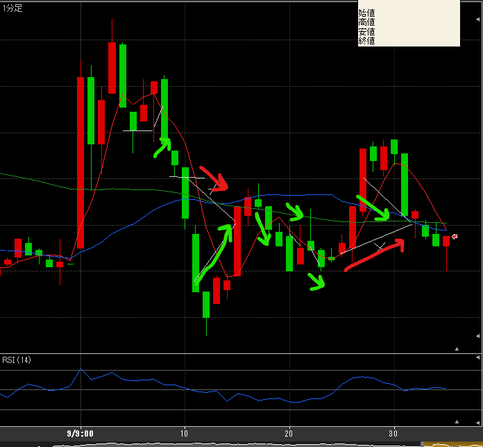
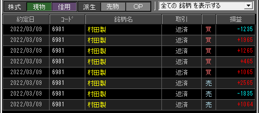

---
title: トレード 3/9(+5319)
date: "2022-03-09T09:34:48+09"
image: "220309_/image.png"
thumbnail: trade.png
tags: ["trade"]
---

### 結果:+5319

- 手堅く動けた。
- 損は２回、IN直後の大きな動きだったが、揺り戻しを見込んでナンピン、結果どちらも差し引きでプラスで終える。

### 考察・心理状態

昨日のキツイ下げからの反発VSリスクオフで方向感は中々定まりにくいかなと思った。移動平均の上下をスイングする型で、そこは予想通り。今までだと翻弄されていたけど、ナンピンでうまく立ち回ることができた。

日経平均と村田のトレンドがかなり異なっていたので、日経の移動平均もわりと見ていたから、村田だけでは分からない反転の気配を読み取ることができていたかも。ナンピンで助かったところも、日経を見てれば気を付けることができたかもしれない。

大きくどんと構えるよりは、トレンドを細かく拾っていく方が向いてる？リスクも少ないかも。向き不向きというよりは、地合いでも変わってくるかもしれない。

ここ数日調子が良い。地合いなのか？売買高が多いのも影響あるかも。ヨコヨコ・スイングなど色々なパターンで勝てていることを考えると、着実に学習できているのかもしれない。

### 次回から：

- 寄り後待ち時間は５分にする
- 日経平均の1分足もよく見るようにする。
