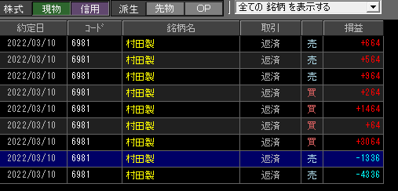

### 結果:+1376

- 特別気配で上昇？と思って慌てて買い入れるも、60T近くマイナスを出す
- その後着実に勝ちを重ねてって、13Tプラスくらいまで持っていた

### 考察・心理状態

- 特別気配は特別気を付けないとダメだった、足5本はちゃんと待つ。
- 6000もマイナスいったのにプラスで終えた、最初のが無ければ7000も勝ってた…余計なことをしなければ、着実に延びている手ごたえがある。
- 20分頃、このまま売りが続くのかと思ったけど「20分ゾーン入ったな…」と様子見た結果反転、うまく回避できた！

### 次回から：

- 寄り付5分待つが、特別気配が出た場合は、5本足が出るまで待つ。
- そろそろ調子に乗ってケガする頃合いな気がするので、気を付ける。