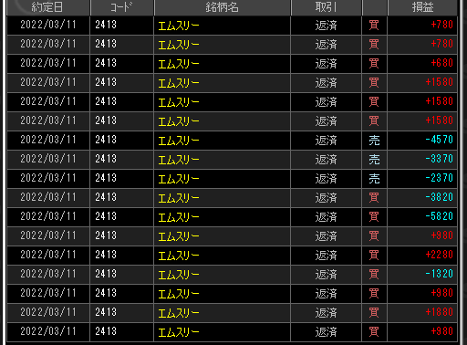

### 結果:▲7190

- 20分頃までで5000くらいプラスだった
- 23分の売りで大負け、ナンピンも刺さらず
- -14000まで行ったが、その後300単位で買って7000円まで戻した

### 考察・心理状態

- 今回は村田ではなくエムスリー。慣れてる銘柄より売買高で行ったけど、いつも通りの取引と変わらなかった。はじめの5分で銘柄選定するのは良い
- 20分の魔の時間…警戒するべきだった。4％近いので、それ以上下がる可能性が低いことも織り込むべきだった。

### 次回から：

- はじめの5分は売買高の検討に使う
- 20分タイム大丈夫か？と思ってたけどやっぱりちゃんと警戒する。