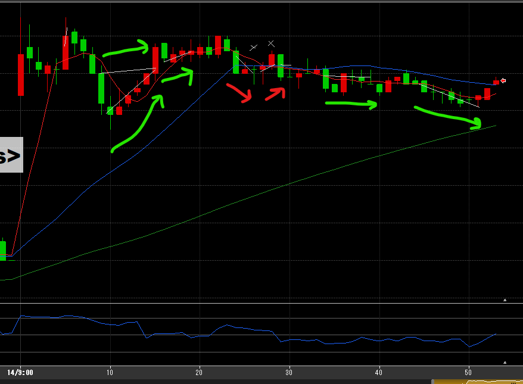
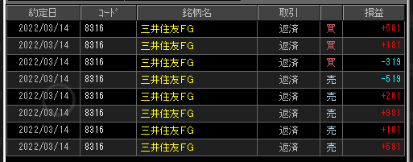

---
title: トレード 3/14(+1948)
date: "2022-03-14T09:54:53+09"
image: "220314_/image.png"
thumbnail: chart.png
tags: ["trade"]
---

### 結果:+1948

- これまで通り、チャートを頼りに手堅く動けた
- 損切は2回、20分ゾーン

### 考察・心理状態

- 売買高の多そうな三井住友FGをチョイス。あんまり動きは無かった。全体的に少な目？
- わりとフラットにやれたかも。儲けたい！の焦りを抑えられた

### 次回から：

- 20～25分はやっぱ警戒する。