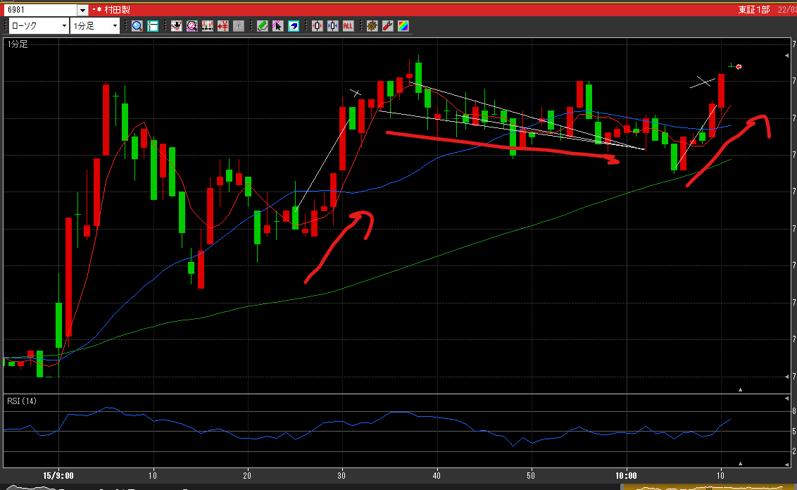
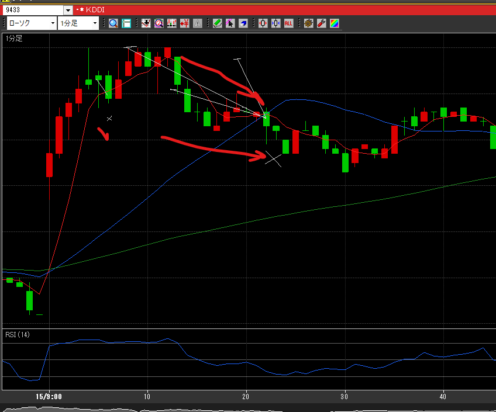

---
title: トレード 3/15(▲11728)
date: "2022-03-15T10:12:10+09"
image: "220315_/image.png"
thumbnail: chart.png
tags: ["trade"]
---

### 結果:▲11728

- 前半はKDDI、値動きがあんまりないと思って後半は村田
- KDDIはまだ上がると思って買いで入るも、勢い続かず。
- 村田は参画もみあいになってので売りポジしたら逆・その後買い続くかと思いきや、下げてく。すべて裏目の一日

### 考察・心理状態

- 寝不足で判断力も鈍った？焦りの追っかけポジションが多い
- RSIを見れば避けられたかもしれないポジがある

### 次回から：

- これと言って材料の無い時はRSIもよく見る
- 落ち着いて。