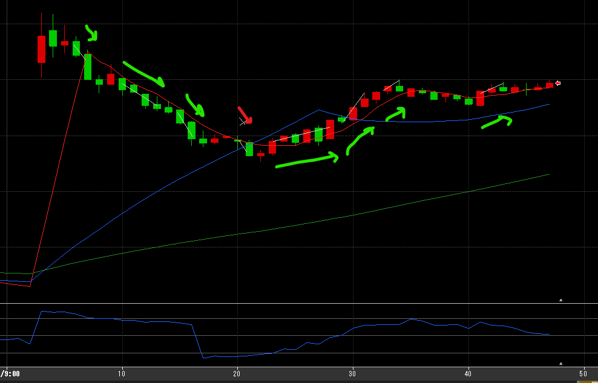
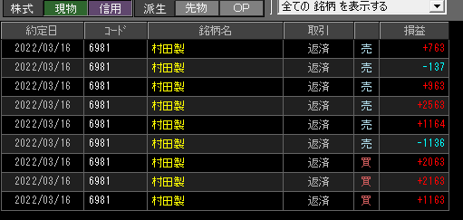

---
title: トレード 3/16(+9569)
date: "2022-03-16T09:44:21+09"
image: "220316_/image.png"
thumbnail: 2022-03-16-09-51-43.png
tags: ["trade"]
---

### 結果:+9569

- RSIを警戒しながら細かく10～20Tickを重ねていった
- 20T超えが3回・10Tが2回

### 考察・心理状態

- RSIが今日は有効だったかもしれない。上がってもここまでかな、のラインを見定めることができた。
- 売買高を見て、SMBCにしようと思ったけど値動きが小さいので村田に変更。3000円台では値幅も少ない？Tick単価だけじゃなく価格も参考にするべきかも。

### 次回から：

- 売買高だけじゃなく値動きも見る
- **勝てなさそうな相場・コンディションの時に無理に勝とうとしない。**