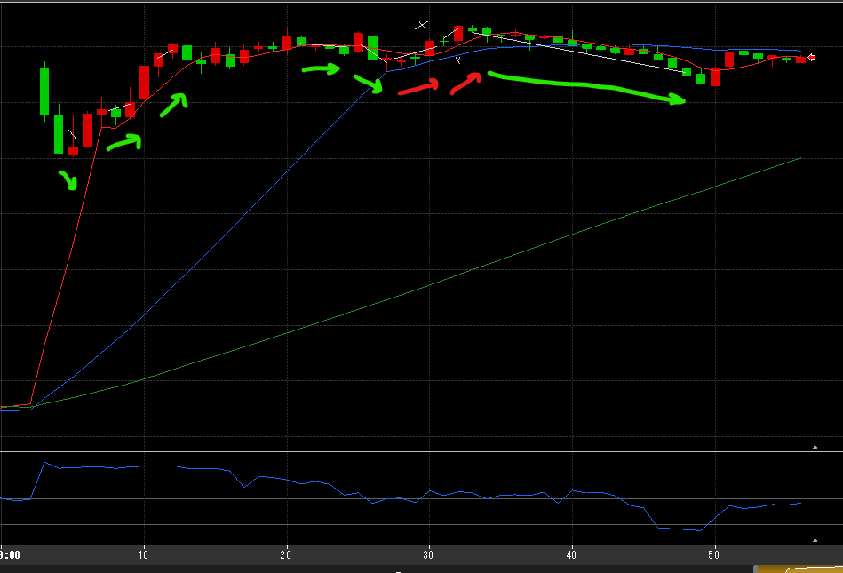
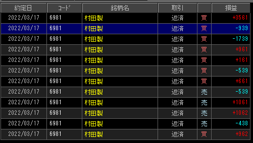

---
title: トレード 3/17(+4235)
date: "2022-03-17T09:50:32+09"
image: "220317_/image.png"
thumbnail: 2022-03-17-10-02-08.png
tags: ["trade"]
---

### 結果:+4235

- 村田、一気に4％台まで上げたレンジを行ったり来たり
- 売りのタイミングを2回ミスりつつ、最後に10分じっくり持って30T獲得

### 考察・心理状態

- NY・日経先物から上昇基調はわりと明確だった
- そろそろ下げるだろと思って入った赤2本。移動平均を突き抜けるか注視しておくべきだった
- 最後抜け所も妥当かな。警戒する基準を明確にしておいた方が良いのかも
- 損切がわりとマシになった？ちょっとでも自信が無かったらもっと速く切れるようになりたい

### 次回から：

- まだ逆張りっぽいことをしてしまうので、移動平均のルールをもっと守る
- 損切をもっと早くできるようにする