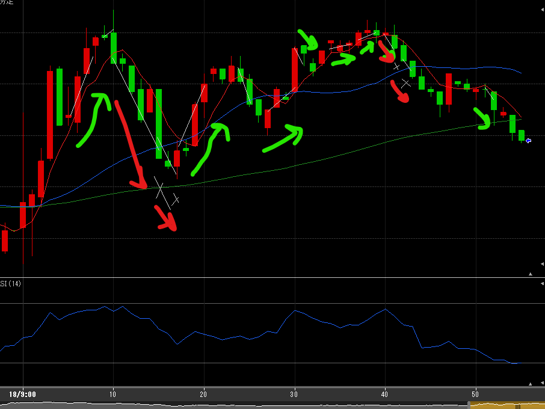
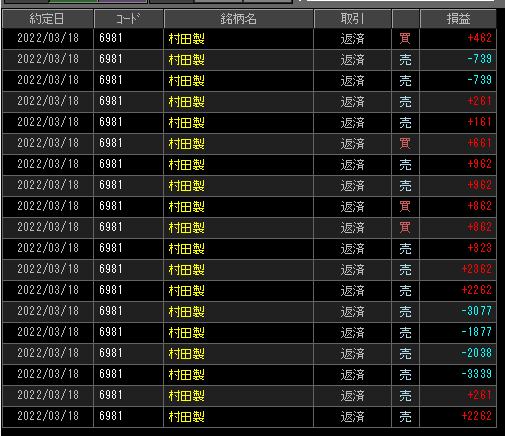

１---
title: トレード 3/18(+854)
date: "2022-03-18T09:54:37+09"
image: "220318_/image.png"
thumbnail: chart.png
tags: ["trade"]
---

### 結果:+854

- 10分台の反落を読めず大きく損。その後細かく勝ちを重ねていって一応プラス

### 考察・心理状態

- 反転の読みが結構難しい。分からない、怪しいなと思ったらRSIをちゃんと見る。
- 今日はどれも買いで損してるが、RSIから推測・警戒ができた説。

### 次回から：

- IN前にRSIへの警戒をする