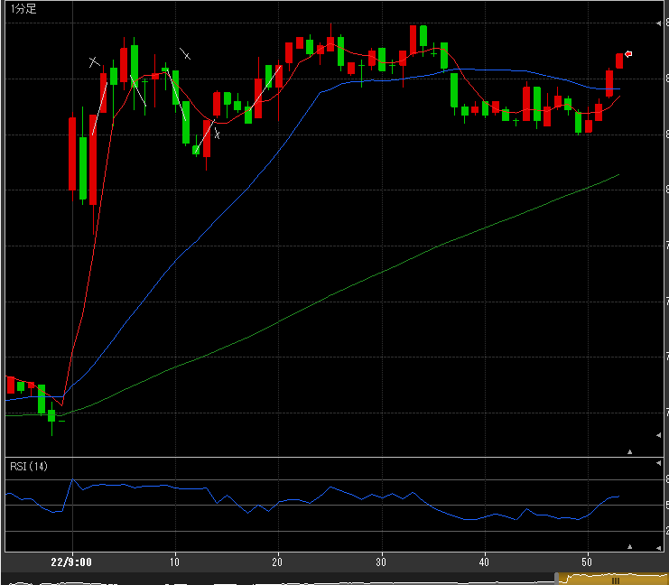
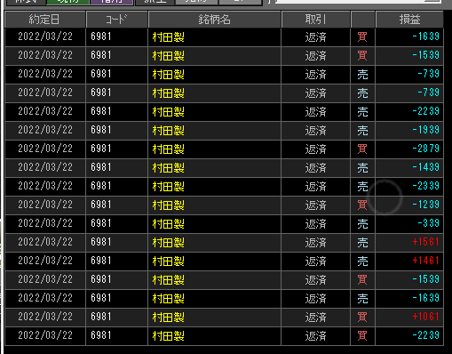

---
title: トレード 3/22(-18403)
date: "2022-03-22T09:54:22+09"
image: "220322_/image.png"
thumbnail: chart.png
tags: ["trade"]
---

### 結果:-18403

- 上がってからのレンジ相場に翻弄されてボロボロ

### 考察・心理状態

- 全然頭働いてなかった…こういう時はやらない方が良いのかもしれない
- 急な買いや売りが激しかったように感じる。いつもと違う動きだった？ 
- レンジ相場で、8060と8020に厚みがあった。もしかしたらあれがレンジの値幅を決めていた？

### 次回から：

- 売買高ちゃんと意識する、低すぎたら村田でも避ける
- レンジ相場に入ったかどうかも意識。ボックスの上下を意識する。
- 寝不足、コンディション悪い時は避ける。機会の損切も意識する？