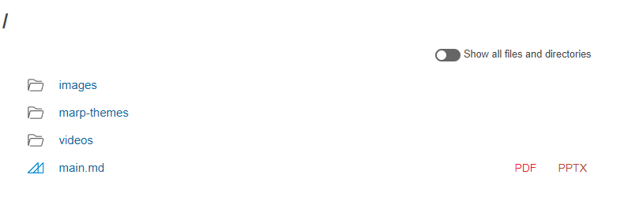

---
title: Markdownでスライドが書けるMarpを使ったら良かった
date: "2022-03-24T00:42:51+09"
image: "220324_marp/image.png"
thumbnail: 
tags: ["Software", "Draft"]
---

[Marp](https://marp.app/)というMarkdown形式でスライドが作れるツールがあって、最近使ってみてすごい良かったのでメモしてみます。
今更自分が書かなくても検索すればいっぱい出てきますが。。

## 環境構築

npmでインストールして、`npx marp`で実行できます。以下の感じ。

```sh
$ npm install --save-dev @marp-team/marp-cli
$ npx marp ./slide_folder -s
```

-sはサーバーモードのオプションなので、これでサーバを立ち上げた後ヴラウザで`localhost:8080`にアクセスすると指定したパスのフォルダ一覧が表示されます。そこの.mdファイルを選択するとスライド画面に映るので、サブモニタやZoomの画面共有で使えますし、発表者ノートのウィンドウも立ち上がります。



## スライドの基本構成

`## 見出し`と書けば見出し、`- リスト`と書けばリストが使えます。この辺はマークダウン的に記述できて、水平線`---`がスライドの区切りとなっています。

```markdown
---


## 日辻
- 主にプログラミングを使った表現に関する業務に従事
- openFrameworks / Arduino / Fusion360 / Houdini / touchDesigner etc...

<!-- コメントは発表者ノートとして使用可能 -->
---
```

このように書くと、表示はこんな感じ。

