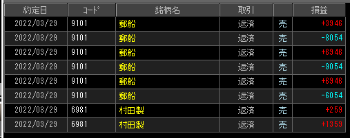

---
title: トレード 3/29(-3706)
date: "2022-03-29T10:03:17+09"
image: "220329_/image.png"
thumbnail: chart.png
tags: ["trade"]
---

### 結果:-3706

- 郵船でスイング

### 考察・心理状態

- 深夜仕事明けで本調子じゃないけど、そろそろやりたかったので。
- 村田とか、全体的に動きが薄かったので1Tick10円の郵船やってみた。デカいけど、慣れればできそう。

### 次回から：

- 「今からどっちに動くか」ではなく「今入れそうか」をしっかり意識する。
- 体調を維持する方法