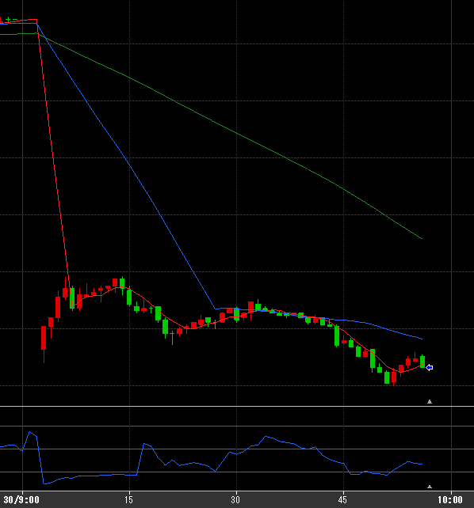
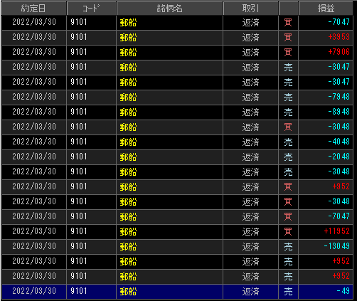

---
title: トレード 3/30(-38755)
date: "2022-03-31T09:44:28+09"
image: "220331_/image.png"
thumbnail: chart.png
tags: ["trade"]
---

### 結果:-38755

- 郵船でスイングに翻弄された

### 考察・心理状態

- 言い訳かもしれないが、SSDが調子悪くてテンポ崩れた
- 勝ちが続いていたので、過信しすぎた。大型株は全く勝手が違うので、これはこれで続けないとダメかも。
- 下げきっていて取りに行きづらいのに、金額に目がくらんでしまった、村田にしておけばこうはならなかったはず

### 次回から：

- 銘柄を金額ではなく、ちゃんとチャートで判断する
- 今週は郵船禁止