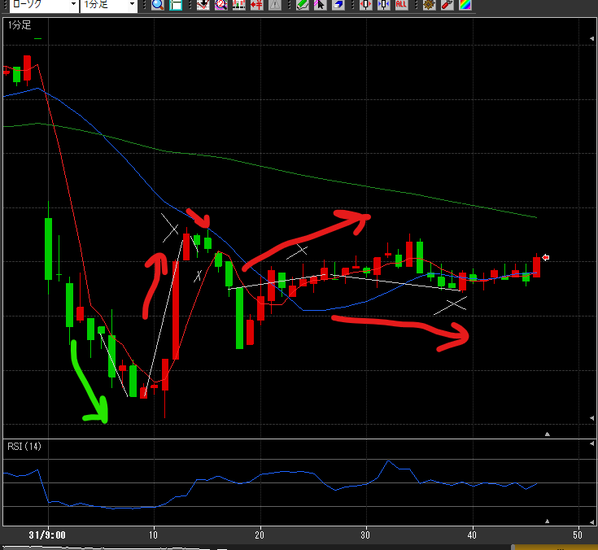

---
title: トレード 3/31(-11257)
date: "2022-03-31T09:46:05+09"
image: "220331_/image.png"
thumbnail: chart.png
tags: ["trade"]
---

### 結果:-11257

- 気を取り直して村田。12分の踏み上げを喰らい大ダメージ
- その後も、プラスを握りすぎるミス連発

### 考察・心理状態

- 12分のがショックすぎて、取り返したいというマインドになってた…
- 30Tくらいあったのに、まだ足りないと思って握りっぱなしで損になるパターンをやった。これは完全にダメマインド

### 次回から：

- 損は無視する。損切を取り返そうとしない