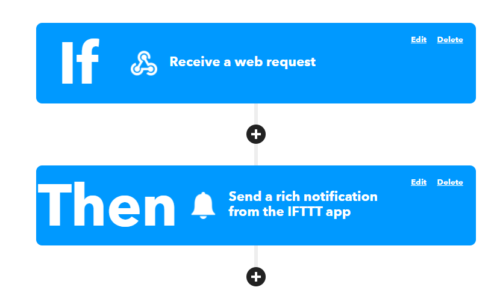
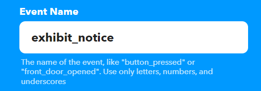
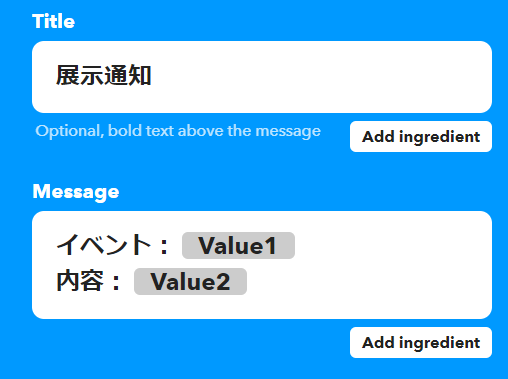
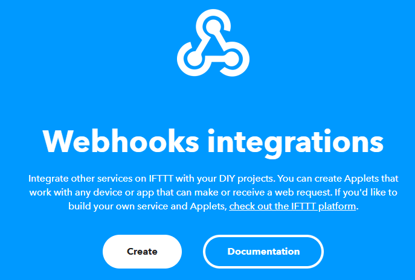
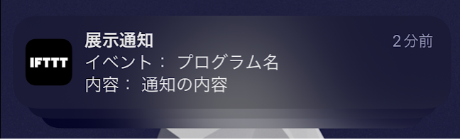

---
title: 自分のプログラムからIFTTTで通知をサクッと飛ばす
date: "2022-04-04T17:13:12+09"
image: "220404_iftttnotice/2022-04-04-18-24-35.png"
thumbnail: "2022-04-04-18-24-35.png"
tags: ["Software", "openFrameworks", "JS/TS"]
---

展示や自作プログラムで、日報とか問題が起きた時のアラートをサクッと通知したいときがある。IFTTTをiPhoneにインストールしておけばHTTPリクエスト叩くだけで通知を呼べるので、汎用の通知アプレットを作った。IFTTTの管理画面が何度やってもどこに何があるか分からなくて迷子になるので、ここにメモ。たまにしか開かないからかな…？

## アプレットの用意


Web hookでリクエストを受けて、それを通知で飛ばすだけ。それぞれイベント名と、通知する時のタイトル・文章を設定しておく。





Value1・2は引数なので、プログラム名と状況を表示するようにしておいた。

## 送り方



[Webhook](https://ifttt.com/maker_webhooks)の項目にあるDocumentationの欄に詳細が書いてある。`https://maker.ifttt.com/trigger/exhibit_notice/with/key/YOUR_KEY_VALUE?value1=hoge&value2=hoge`を叩けば通知が発火する。YOUR_KEY_VALUEはそれぞれのキー

URLクエリではなくJSONをbodyに入れてやる方法もあるんだけど、oFだとアドオン無しでやる方法が見つからなかったのでクエリパラメータで…しかしoFだとパーセントエンコーディングが面倒くさい…

## oFからリクエストを送る

`ofLoadURLAsync`で送りっぱなしにすれば、通信待ちも無く行けるので展示とかで使える。これなら追加のアドオンもいらないので、サクッと使える。日本語だとエンコーディング問題があるのでどうしたものか。。固定メッセージならそのまま張り付けちゃえば良いんだけども

```cpp
stringstream ss;
ss << "https://maker.ifttt.com/trigger/exhibit_notice/with/key/";
ss << "YOUR_KEY_VALUE";
ss << "?value1=%E3%83%97%E3%83%AD%E3%82%B0%E3%83%A9%E3%83%A0%E5%90%8D"//プログラム名
ss << "&value2=%E9%80%9A%E7%9F%A5%E3%81%AE%E5%86%85%E5%AE%B9"//通知の内容

ofLoadURLAsync(ss.str());
```

## node.jsでリクエストを送る

node.jsはクエリのエンコードもそのまま出来るので、axiosでこんな感じ

```js
const axios = require('axios');

let url = 'https://maker.ifttt.com/trigger/exhibit_notice/with/key/'
url += 'YOUR_KEY_VALUE/';
url += '?value1=' + encodeURIComponent('プログラム名');
url += '&value2=' + encodeURIComponent('通知の内容');

axios.get(url);
```

## 結果

これで無事通知が飛ぶ。展示仕事とかで常に見るわけじゃないけど、設営直後のランニングテスト時期とか、一時的に通知飛ばしとくようにしたいな～と思った時に使えるようにしておきたかったので、ここにメモ。

