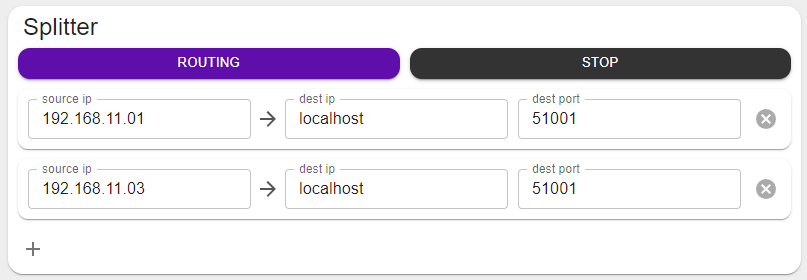
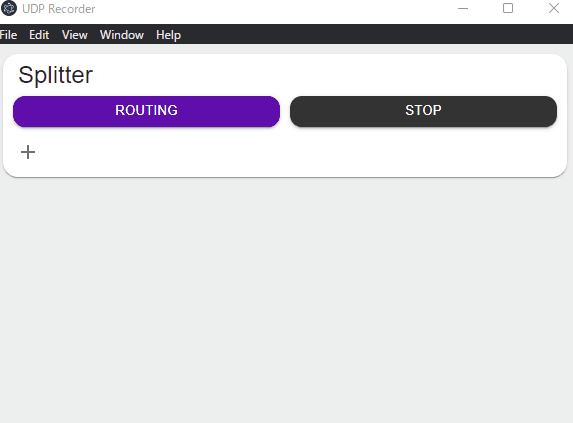

---
title: Reactで追加・削除可能なリストをサクッと作る
date: "2022-06-07T14:22:58+09"
image: "220607_react-vector-list/main.png"
thumbnail: "main.png"
tags: ["React", "JS/TS"]
---

## UDPパケットを分岐して捌きたい



あるデバイスから飛んでくるUDPを受ける仕事で、ハード側は試作機のようなものなのでSSHでログインして送信先のIP・ポートを切り替えて再起動して、、というのがちょっと面倒くさい。

受け取り側はコンテンツ開発用PCとかハード担当のデバッグPCとかいくつかあって、状況で切り替えなきゃいけない上に4台もある。なので、一挙に受け取って転送先を切り替えたり、同時に分配したりできるようなユーティリティを作ってます。（今書きながら思ったけど、探せばこういうツールありそうだな…？）

## 項目を増やしたり消したり、編集する



Reactで任意の項目を増やしたり消したりして、中身を編集するみたいなのを何度も書いてる気がするので、サクッと1個のオブジェクトで扱えるするようなコードを覚え書き的に書いておきます。

### 項目用のオブジェクトrouteを作って配列として扱う

```js
//上GifのPaper1個分に対応するオブジェクト
export type route = {
	srchost: string,
	dsthost: string,
	dstport: number,
}
```

必要な情報を持ったオブジェクトを定義。受信先IP・送信先IP・送信先ポートが項目として用意します。

```js
	// state hook
	const [routeList, setRoute] = React.useState<Array<route> >([]);

	const addRoute = () => {
		const rt: route = {
			srchost: '192.168.11.0',
			dsthost: 'localhost',
			dstport: 51001,
		}
		setRoute(routeList.concat(rt));
	}

	const removeRoute = (index: number) => {
		const list = routeList;
		list.splice(index, 1);
		setRoute(list.concat([]));
	}
```

配列を入れて置くためのhookを用意して、新規項目の追加と、削除用のメソッドを用意する。removeRouteでは空の配列をconcatしているが、これはレンダラを更新してもらうため。お作法として良いのかはちょっと自信無い。

```jsx
{routeList.map((rt, i) =>
<Paper key={i}>
	<Box>
		<TextField 
			label='source ip' 
			size='small' 
			value={rt.srchost} 
			onChange={(e) => {changeSrcHost(i, e.target.value)}}/>

		<IconButton key={i} onClick={() => {removeRoute(i)}}>
			<CancelIcon/>
		</IconButton>
	</Box>
</Paper>
)}
```

mapで回してコンポーネントを配置する。この時keyは忘れずに。`onChange`はアロー関数使って、引数にインデックスを渡してあげる

```js
	const changeSrcHost = (index: number, host: string) => {
		const list:Array<route> = routeList;
		list[index].srchost = host;
		setRoute(list.concat([]));
	}
```

`onChange`の呼び出し先はこんな感じで、リストを編集したらまたconcatした新しい配列をsetしてあげればおｋ。