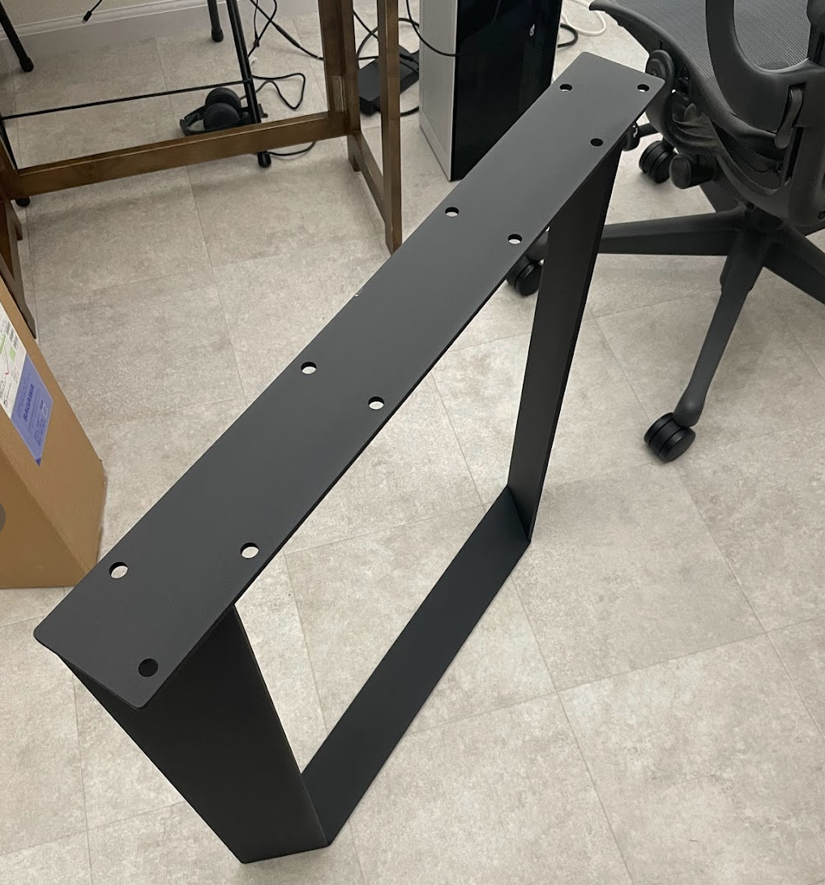

家を引っ越して以前より大きい机を置けるようになったので、机を新調しました。
**EMARF**という大きめの板材から[Shopbot](https://shopbot.vuild.co.jp/)で切り出してくれるサービスがずっと気になっていたので、利用してみることに。

## とにかくケーブルを円滑に運用したい

仕事柄ハードウェアを扱うことが多くて配線がごちゃ付きがちなので、モニターの手前にスリット、右手側にポケットを付けてケーブルを引き出しやすいようにしています。

ちょっとしたUSBやACはスリットから、ラズパイやArduinoなんかを使いだして色々結線が必要になってきたら右側のポケットからケーブルを出す、みたいな運用にすることで、少しでも綺麗な机を保てないか…という試み。まだ運用を想定した配線などは出来ていないので、今回は天板を発注して組み立てるところまでを書いています。

## Fusion360で机を設計する

まずFusionn360で欲しい形状をモデリングします。EMARFはかなり自由に形状を作れるのですが、机にゴテゴテギミックを入れすぎても使い辛そうですし、複雑だと設計ミスも起きそうなので、今回は部屋に収まる寸法の直方体に対して

- 奥側にモニタアームを挟む凹み
- モニター手前にケーブルやタップを通しておけるスリット
- 右手側に混み入った配線やドッキングステーションを入れておけるポケット
- 既製品を組み付ける鬼目ナット用のポケット穴

の4つを加えることにしました。**ポケット穴があるので、天板の裏側から加工していく**形になります。

## 設計したらEMARFのWebへアップロード

Fusion360は専用プラグインが用意されているので、ソフトウェアから**直接EMARFにアップロードする**ことができ、EMARFのWebサイト上で加工シミュレーションが表示されます。

機材ポケットはくり抜いた板材がそのまま蓋になって木目もちゃんと繋がっている…みたいにしたかったのですが、結構マージンを取らなければならないようで隙間が大きくなってしまうので、今回は部材の外側に作りました。

木目の向きだけでも揃えたかったけど、**机全体の幅が短くなる**のでめっちゃ悩んだ挙句、断念…どうしても気になったらいっそ単色で塗っちゃうとかも可愛いかも、と前向きに考えることにします。

## 注文後、1週間くらいで到着

Webで発注すると、その後はメールで見積もりと振り込みの手続きを進めます。色々な条件によりそうですが、期日以内に振り込むと1週間くらいで現物が届きました。届いた直後の姿。

手が触れる角だけ軽く面取りをし、ワトコオイルを塗って仕上げます。

## 足の取り付け

乾いたら、[かなでもの](https://kanademono.design/collections/popular-picks/products/sls-k12)で一目惚れした足を取り付けます、見る角度で太さの変わる面白い作りで、鉄の黒々とした粉体塗装が重厚感すごい。実際重い。

鬼目ナットを埋め込み穴の取り付け。以前事務所の机を作った時は自分で穴位置を出して、貫通しないよう気をつけながら穴開けをしてたんですが、今回は図面通りの位置に穴が空いているので鬼目ナットをねじ込むだけです。最高…

完成！全て図面通りで、各要素の機能もうまく機能してくれそうです。うーんまた何か作ってみたい。。meviyと違ってモノが大きいので、中々チャレンジする機会が少ないのがもどかしい。