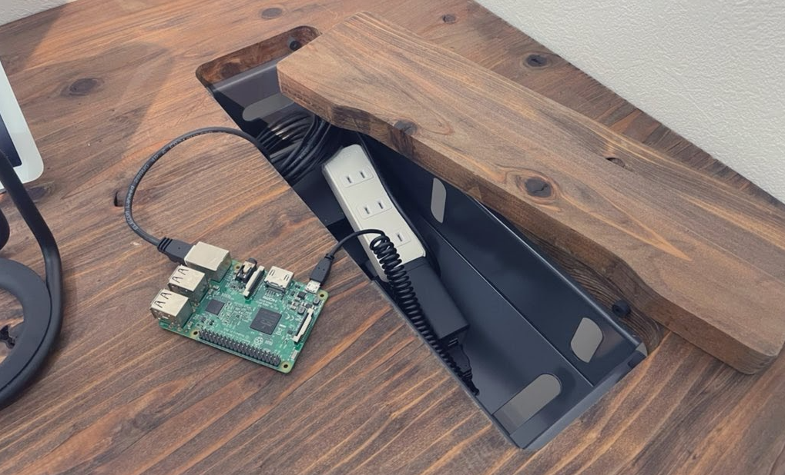
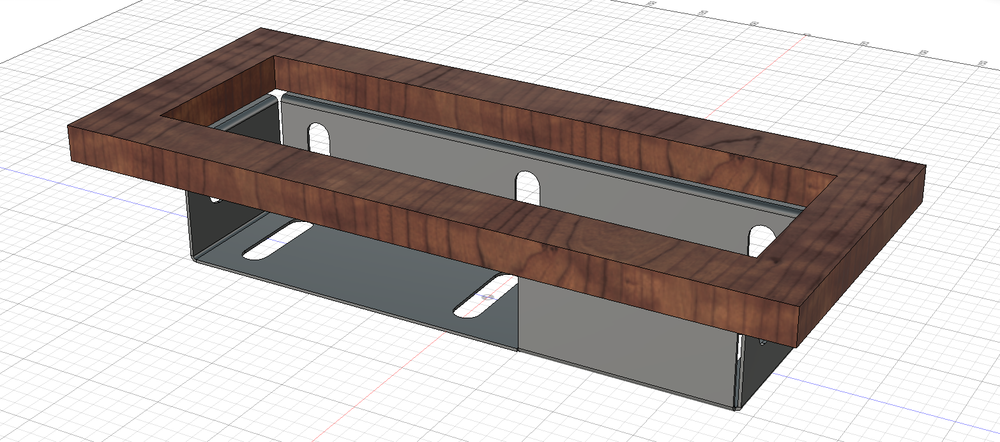
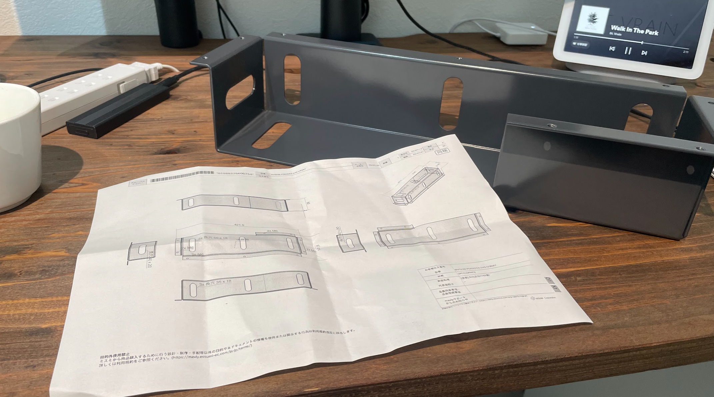
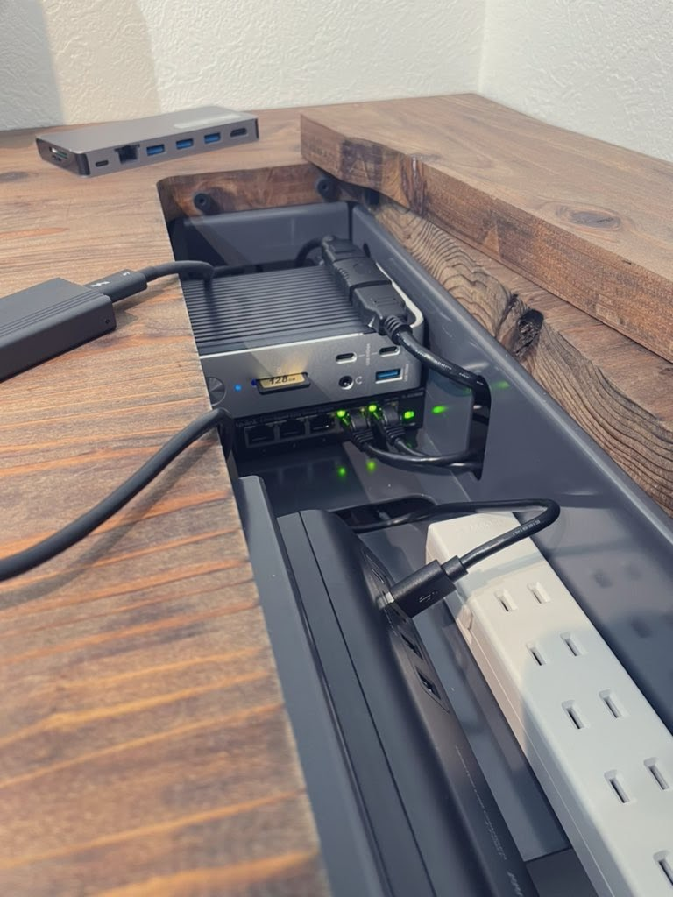
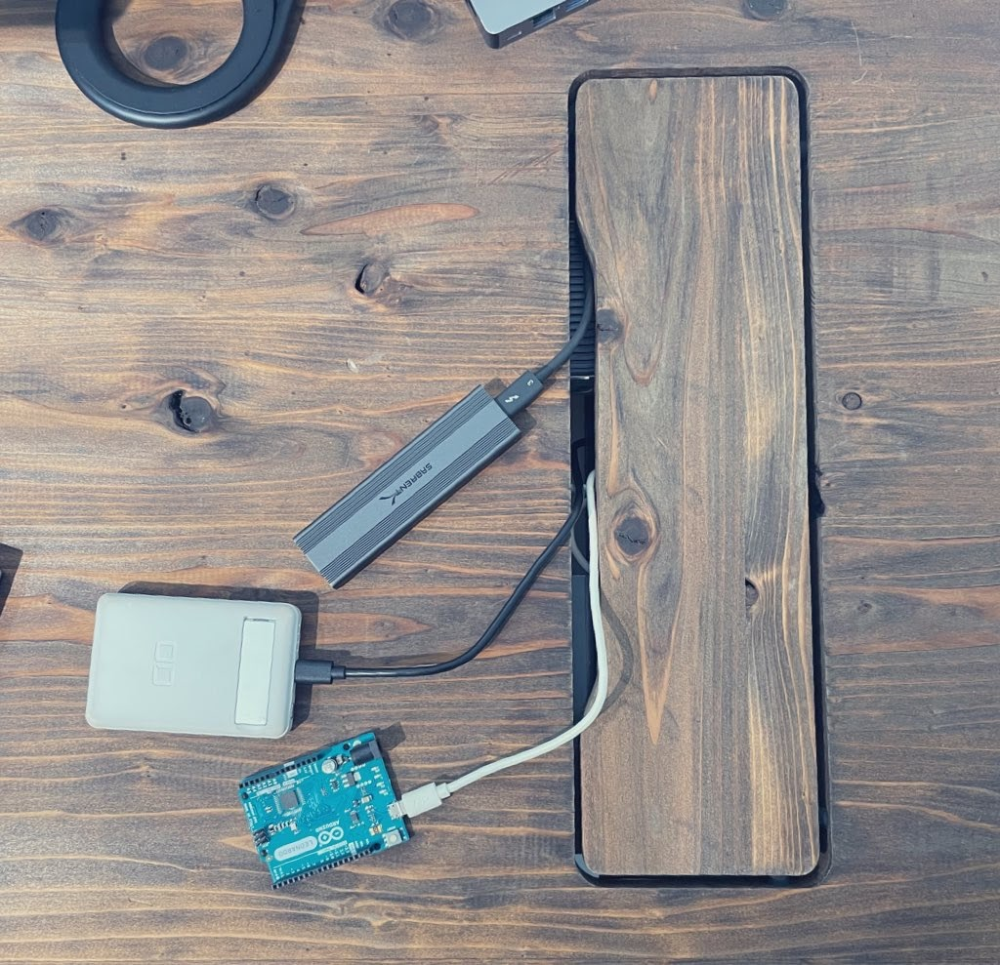
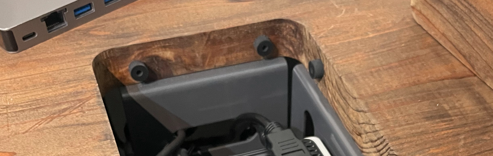

---
title: EMARFとFusion360で机を作る(ケーブル収納編)
date: "2022-08-21T19:58:36+09"
image: "220821_newdesk2/2022-08-21-20-02-08.png"
thumbnail: "2022-08-21-20-02-08.png"
tags: ["Hardware", "Mechatronics", "Developed"]
---

前回机の天板を作るところまで書きましたが、その後インターフェースの収納用ポケットが完成したので、続編として書きます。

## モデリングをする

机に設けたポケット部分にUSBハブや電源を貯めておきたかったので、それ用のカゴ的な部品を設計して、ミスミのmeviyというサービスで発注しました。ケーブルを通せるように各面に長孔を開けたのと、幅が収まらないような機材を入れたくなった時のために、一部を開口にして多少はみ出しても大丈夫なようにしました。

作業の邪魔になることを恐れて穴自体を細めに作ってしまった故の仕様なので、今思うともう少し天板の穴自体を大きくしてあっても良かったのかもしれない。

## 発注をする

塗装や材質にもよりますが、標準的な仕様だとだいたい3～5営業日で届きます。meviyに頼む時はCADデータで完結して図面は起こさないので、毎回図面が同封されてるのがちょっと楽しい。下穴開けて鬼目ナットにしようか迷いましたが、M5程度だしそんな力もかからないのでタッピングビスで入れてしまいました。

### USBハブや電源タップを隠しておく

最終的にはこんな感じになっています。各種機材を入れておくことで机の物を減らしつつ、PC裏に回らなくてもいろんなIFにアクセスができるようになりました。先ほどの開口も横からケーブルも入れやすいので、意外と効いています。

フタは開け閉め用の隙間が空いているので、フタを閉じた状態でも機材を抜き差しもできます。結局バタバタと作業する時は開けっ放しなんですけどね……板金を2mmだけ内側にせって来るようにして、フタはその上に乗っかってる状態です。結構ギリギリで危なかった…

乗せるだけだと隙間が等間隔にならなくてキレイじゃないので、マージンと同じ5㎜の高さのゴム足を張り付けて、雑に閉じてもちゃんとフタが中央に来るようガイドさせています。