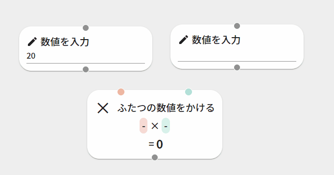
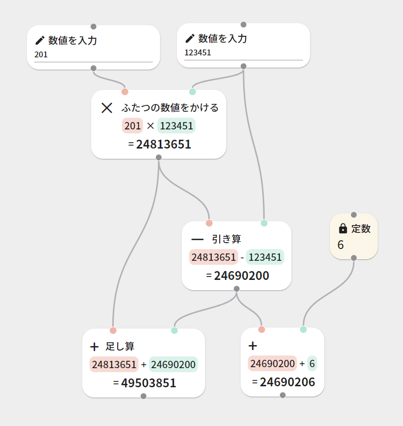
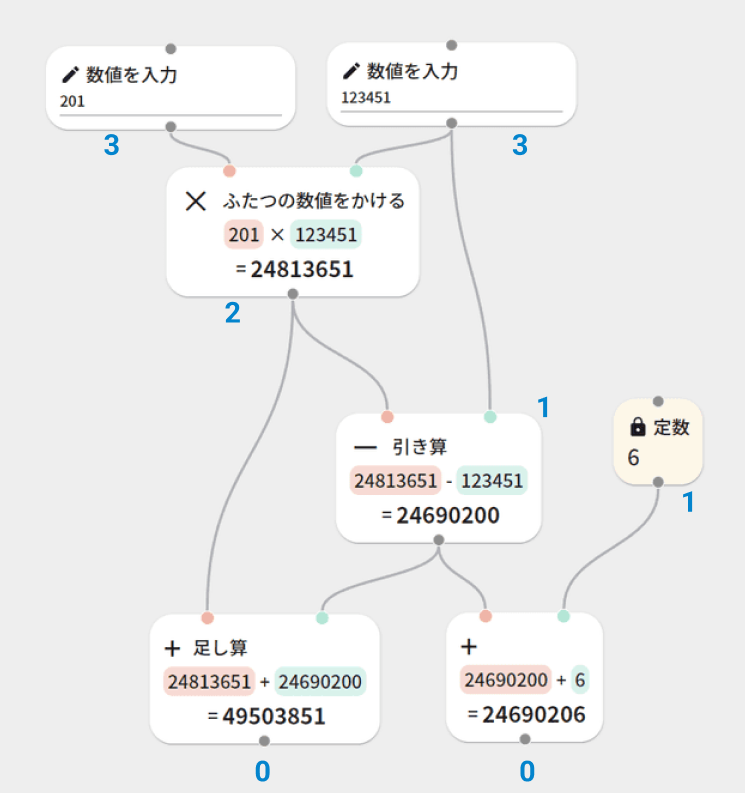
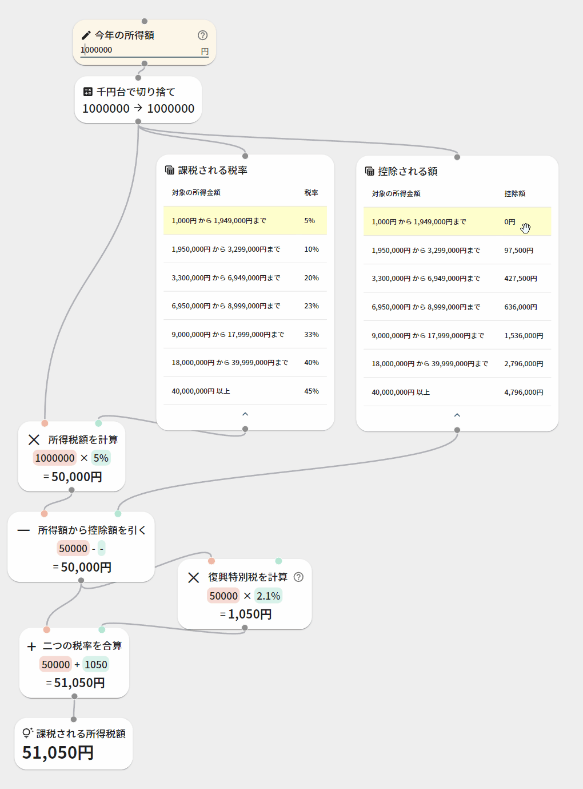

---
title: React Flowで計算可能な自作のノードエディタを作る
date: "2022-08-22T13:46:44+09"
image: "220822_reactflow-calc/2022-08-22-15-06-37.png"
thumbnail: "2022-08-22-15-06-37.png"
tags: ["React", "JS/TS"]
---



お金の計算をノードで計算できたら楽なのではないか、という事を思って、計算ツールのようなものを最近チビチビと作っています。

[React Flow](https://reactflow.dev/)というライブラリが結構よさげで、動かす・繋ぐ・切り離す・消すみたいな基本的な操作ができるようになっているので、自分でカスタムコンポーネントと計算を作れば自作のノードエディタが作れます。

## 計算順序について

色々あるノードエディタがクックの順番をどう管理しているのか気になってたんですが、ReactFlowにそういった機能は特にないので、自分で考えました。もうちょっと探したらより良いノウハウとかまとめられているのかも…

#### ノードの構造

まずReact Flowのシステムでは、基本的にネットワークの情報はNodes<any>型の配列とEdges<any>型の配列によって管理されています。Nodeには固有のidが割り振られていて、Edgesは自信のidと接続しているNodeのidが振られています。トップの画像をJSON形式で出力すると、こんな感じです。（本当は位置情報とかもっとプロパティがあるけど、長くなるので色々省略）

```json
{
    "nodes": [
        {
            "id": "BasicCalcMultiply843",
            "type": "BasicCalcMultiply",
            "data": {
                "label": "ふたつの数値をかける",
                "return": 2469020,
                "arg": {
                    "left": "20",
                    "right": "123451"
                }
            },
        },
        {
            "id": "BasicNumber525",
            "type": "BasicNumber",
            "data": {
                "label": "数値を入力",
                "value": "20",
            },
        },
        {
            "id": "BasicNumber370",
            "type": "BasicNumber",
            "data": {
                "label": "数値を入力",
                "value": "123451",
            },
        }
    ],
    "edges": [
        {
            "source": "BasicNumber525",
            "sourceHandle": "number",
            "target": "BasicCalcMultiply843",
            "targetHandle": "left",
            "id": "reactflow__edge-BasicNumber525number-BasicCalcMultiply843left"
        },
        {
            "source": "BasicNumber370",
            "sourceHandle": "number",
            "target": "BasicCalcMultiply843",
            "targetHandle": "right",
            "id": "reactflow__edge-BasicNumber370-BasicCalcMultiply843right"
        }
    ]
}
```

上の構造では掛け算のノードが一番上にあるので、順番に計算させようとすると数値入力の情報を待たずして計算をしてしまいます。

上に何も繋がってない要素から順に、下って計算するようにしたいのですが、例えばこんな風に1つのノードが複数に繋がっていたりする場合、順番をきっちり整理しないと取りこぼし（上のノードが計算前なのに、前の結果を計算しちゃうというような事態）が発生します。



#### 何も繋がっていないノードを0として、経路の深さをカウントする

上から順番に計算するために、まずゴールからのエッジの数(=深さ・ネスト)を数えました。それ以上何もつながっていない終端のノードを全て0とし、1つ上がる度にカウントを1増やします。複数の経路がある場合は、もっとも大きいカウントを優先します。



ネストの深さの計算と実装はこんな感じ。エッジを1つずつ評価して、接続元のネストが浅いか同一の場合には、接続元のネスト数が接続先⁺1になるように調整します。

これを何度か繰り返して、更新が必要なくなったらネストの評価は完了です。

```typescript
//NESTの計算
let changed = true;
let nest_max = 0;//計算時に使うnestの最大数
while (changed)
{
    //変更が行われなくなるまでエッジの走査を繰り返す
    changed = false;
    for (let e of edges)
    {
        const i_src = getNodesIndex(e.source);//接続元のインデックス
        const i_dst = getNodesIndex(e.target);//接続先のインデックス

        //接続元の次数が接続先以下だった場合、nestを接続先⁺1に変更する
        if (nodes[i_src].data.nest <= nodes[i_dst].data.nest)
        {
            nodes[i_src].data.nest = nodes[i_dst].data.nest + 1;
            nest_max = Math.max(nest_max, nodes[i_src].data.nest);
            changed = true;
        }
    }
}
```

あとはNodeを順に走査していって、数が大きい物から順番に計算していけば、前後関係を正しくクックを走らせることができます。

## 「ややこしいお金の話し」をほどくツール

下は試作してみた[所得税の計算方法](https://www.nta.go.jp/taxes/shiraberu/taxanswer/shotoku/2260.htm)です。所得税は所得額によって適用税率と控除額が決まっているので、金額から適用範囲を確認してそれを計算して…みたいなのがややこしく「じゃあいくら稼ぐと税金どれくらいなの？」の肌感が分かりにくい…ノードになっていれば、どういうルールなのか見通しも立ちますし、数字入れるだけですぐ数字が出るのでめっちゃ分かりやすいと思います。（個人の感想です）



世界情勢とかライフステージの変化に伴って税金や助成金とかお金の計算をめちゃめちゃ最近やってたんですが **「まず手順の理解が煩雑で、そこからの計算が大変で、仮定の計算のやり直しがめちゃめちゃしんどい」** と思います。多分現存する資料でパパっと理解・計算できちゃう優秀な人たちがやってるからなんだろうな……これ見りゃ分かるっしょみたいな空気を感じる

どの数値がどう使われてるか、構造が見えてシミュレーションできたらめちゃ楽なのにな～…ノードベースみたいなさ…と思ったので、作ってみることにしました。

若い時に「700万のボーダーラインがあって、それ超えるとグンと高くなるらしいよ」みたいな事を聞いて、そうなんだ…と漠然と思ってた時期があったりしたんですが、そういったことを確認するための障壁が高いと思うし、これを見ると別に急に上がるわけではなくて、控除額によってコントロールされている（ジワジワ上がっていく）という事も分かります。（上記の話は何か他の適用例があるのかもしれないけど、少なくとも所得税の適用についてはその限りでは無さそう）

住宅・医療・相続贈与あたりでもこういうのめっちゃあるので、チクチク作りためていってある程度できたらKeisanみたいな感じで公開したいな～という密かな野望を持ってます。FP勉強したい……