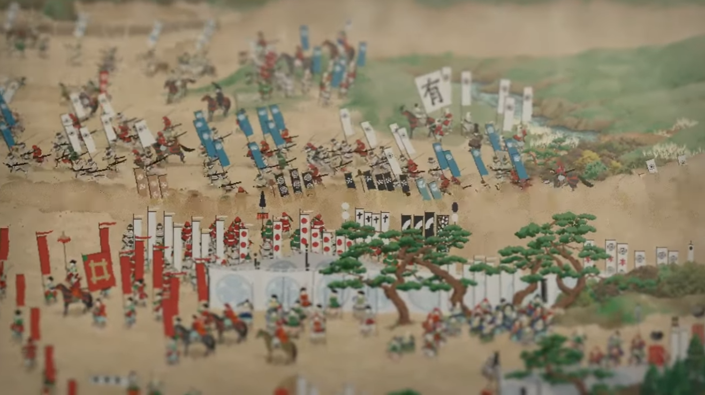

Houdiniで静止画に合わせた絵を出したいとなった時にカメラのバックグラウンド機能を使いますが、この画像のこの領域でレンダリングしたい、となった場合少し厄介でハマりました。


Screen Window X/Y及びSizeで指定することができるのですが、単位がピクセルではなく、解像度に対する比率で指定しなくてはいけません。


しかもX/Yは**中心座標**が-0.5~0.5で、Sizeの比率もカメラのアスペクト比と画像のアスペクト比との関係になるので計算がむっちゃややこしいかったです…正方形の画像に対して画角を縦長比率にすると、こうなる


スプレッドシートで計算できるようなシートを書いていたのですが、いちいち書いて移すのも面倒なので、Pythonでクロップ範囲を変更するスクリプトを書きました。
本当はカメラの中にエクスプレッションで書こうとしたけど、それはそれで面倒くさかった…

### 左上座標化と、画像サイズに対する比率で指定できるようにする

もう少し直感的に指示できるように、画像の解像度を基準としてクロップ位置の左上と、サイズの比率から指定できるようなスクリプトになっています。

冒頭にある **背景画像の解像度・クロップしたいカメラの左上座標・カメラの解像度**の３つを入力すれば、ピッタリの画角を設定してくれます。

```python
# 背景画像のサイズ
image_width = 4096
image_height = 4096

# 背景画像に対して、クロップしたいカメラの位置
crop_x = 0.1
crop_y = 0.25

# 背景画像に対するクロップしたいカメラの解像度
crop_width = 0.25
crop_height = 0.25

# アスペクト比を計算（長手方向がスケールの基準となる）
aspect_image = image_width / image_height
aspect_crop = crop_width / crop_height

# アスペクトに基づくカメラの基準解像度
camera_width_origin = image_width if aspect_image > aspect_crop else image_height * aspect_crop
camera_height_origin = image_height if aspect_image < aspect_crop else image_width / aspect_crop

# クロップの基準となる中心座標
crop_center_x_pixel = (image_width * crop_x) + (image_width * crop_width) / 2
crop_center_y_pixel = (image_height * crop_y) + (image_height * crop_height) / 2

# 画像中心からクロップ中心を引いた値
offset_x = crop_center_x_pixel - image_width / 2
offset_y = image_height / 2 - crop_center_y_pixel

# スケールのサイズ基準となる値
scale_image_pixel = image_width if aspect_image > aspect_crop else image_height
scale_crop_pixel = crop_width * image_width if aspect_image > aspect_crop else crop_height * image_height

# カメラSOPのパラメータに入れる値
Houdini_Camera_X = offset_x / camera_width_origin
Houdini_Camera_Y = offset_y / camera_height_origin
Houdini_Camera_Scale = scale_crop_pixel / scale_image_pixel

# カメラSOPのパラメータを変更する
node = hou.pwd()
cam = hou.node("/obj/cam1")
cam.parmTuple("res").set((int(image_width * crop_width), int(image_height * crop_height)))
cam.parmTuple("win").set((Houdini_Camera_X, Houdini_Camera_Y))
cam.parmTuple("winsize").set((Houdini_Camera_Scale, Houdini_Camera_Scale))
```

### 実際に指定してみる


例えば4096pix四方の背景があって、カメラが置かれてるとします。UVは[こちら](https://commons.wikimedia.org/wiki/File:UV_checker_Map_byValle.jpg)から拝借しました


この時の変数は以下の通り。

```
# 背景画像のサイズ
image_width = 4096
image_height = 4096

# 背景画像に対して、クロップしたいカメラの位置
crop_x = 0
crop_y = 0

# 背景画像に対するクロップしたいカメラの解像度
crop_width = 1
crop_height = 1
```


crop_widthとheightを0.5にすると、右上1/4を残してクロップされます。Screen Windowの値は`-0.25, 0.25, 0.5, 0.5`となりました。このくらいなら自力でもなんとかなりそうです。


更に半分にします。こうすると背景画像とクロップ領域の比率が変わり、パラメータは`-0.375, 0.125, 0.25, 0.25`となります。縦長にクロップしてるのにSizeの指定はXYで一緒…大分直感的ではなくなってきました。


領域をC1・D1の2マスにするとどうでしょうか。crop_xyは`0.125,0.25`、crop_widthは`0.125,0.25`です。
変換すると`-0.3125, 0.0625, 0.125, 0.125`となります。こうなってくると個人的にはかなり計算がキツい…

### あんま使わないのかもしれない

背景解像度とクロップ領域のアスペクト比によって基準となる解像度が変化するので、計算がややこいことになっているような気がします。
なんでこんな不便なんや！と思ったけど普通のCG製作とかではあんま使わないんだろうな

あと「ピクセル単位でピッタリ指示する」とタイトル書きつつスクリプト側でもクロップ範囲を比率指定してるのは、その方がキレイな数字が出やすくて安心だからです。画像解像度が2のｎ乗の時に100x200とかで指示するとすごい半端な数字になってしまう



なんでこんなことをしてたかというと[関ケ原合戦図屏風のシリーズ第二弾](https://www.youtube.com/watch?v=cLALb_5tGQc)を鋭意製作中でして、大きな1枚絵をセクションごとに区切って作ったり書き出しているからでした。本当にこのやり方がベストなのかはよくわからない…