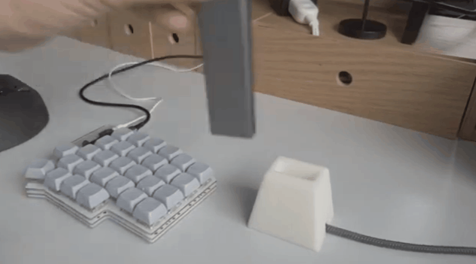

最近Imageclubのあずまさんが#生活治具という言葉を提唱していて、自分もなんかハッシュタグ上げたい！と思ったんですが、生活の軸が仕事と制作すぎて生活治具というよりは業務治具って感じだな…と思ったので、ここにまとめることにしました。生活治具もちょっと何か作れないか考えたいなぁ

### Webカメラをかけておくワイヤーフレーム

事務所のモニタがでかすぎてWebカメラを置く場所が無かったので、棚にひっかけられるような治具を作りました。作品制作で使った真鍮線が余っていたので、それをはんだ付けしてちゃちゃっと制作。

LogicoolのWebカメラはスタンドが縦にも横にも使えるので、この向きでもかけられて丁度良かったです。

### SSDを片手で差し込めるスタンド

仕事用データを入れたM.2タイプのSSDを差す時に、いちいち右手でケーブルを持ち、左手でSSDを差し込むのが面倒だなぁ、、と思ったので作った業務治具。差してる間SSDが机に横たわってんのもなんだか邪魔くさかったので、おさまりがよくなってこれも良い感じです。
